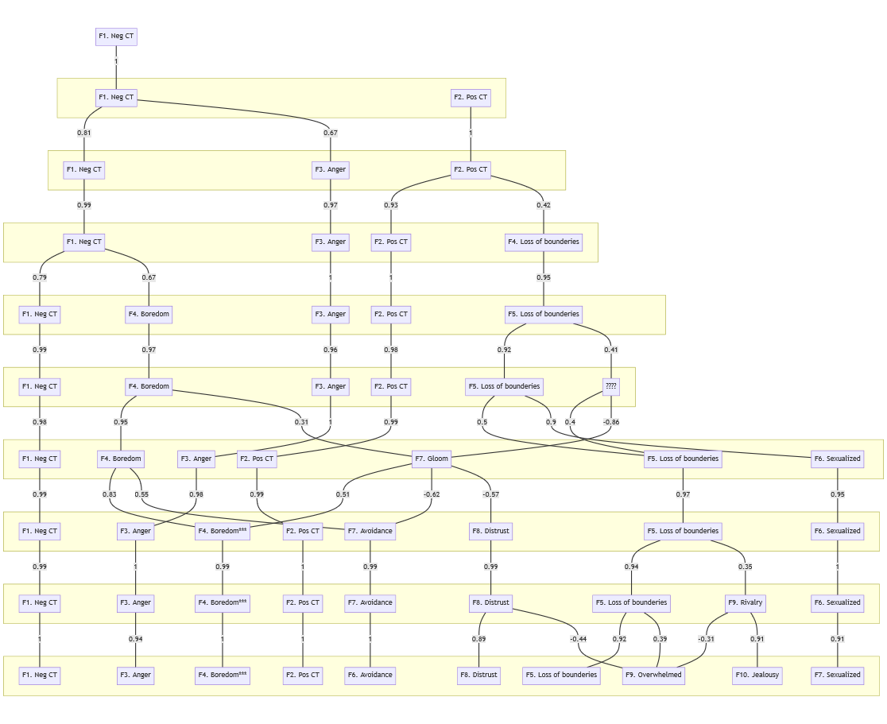

```{r setup, include=FALSE}
knitr::opts_chunk$set(echo = FALSE)
library(psych)
library(Hmisc)
library(see)
library(GPArotation)
library(nFactors)
library(FactoMineR)
library(DiagrammeR)
library(factoextra)
library(parameters)
library(kableExtra)
library(ggplot2)
library(openxlsx)
library(corrplot)
library(haven)
library(readr)
authors <- read_delim("C:/Users/Ouriagan/OneDrive/TRQ_article/authors.csv", delim = ";", escape_double = FALSE, na = "empty", trim_ws = TRUE)
items <- read_sav("C:/Users/Ouriagan/OneDrive/TRQ_article/ct_14_12_2022.sav")
items.df <- data.frame(items)
# attach(ct_14_12_2022)
# items.df <- data.frame(trq1,trq2,trq3,trq4,trq5,trq6,trq7,trq8,trq9,trq10,trq11,trq12,trq13,trq14,trq15,trq16,trq17,trq18,trq19,trq20,trq21,trq22,trq23,trq24,trq25,trq26,trq27,trq28,trq29,trq30,trq31,trq32,trq33,trq34,trq35,trq36,trq37,trq38,trq39,trq40,trq41,trq42,trq43,trq44,trq45,trq46,trq47,trq48,trq49,trq50,trq51,trq52,trq53,trq54,trq55,trq56,trq57,trq58,trq59,trq60,trq61,trq62,trq63,trq64,trq65,trq66,trq67,trq68,trq69,trq70,trq71,trq72,trq73,trq74,trq75,trq76,trq77,trq78,trq79)
# detach(ct_14_12_2022)
itemscomplete.df <- items.df[complete.cases(items.df), ]
attach(items.df)


N <- length(trq1)

#Items mabels and the fonction to find them
labels_items <- label(items.df)
labels.df <- data.frame(Item=1:79, Label=labels_items)
find_label <- function(x) {
  label <- labels.df[labels.df$Item == x, "Label"]
  return(label)
}
```

# Nombre de facteurs dans la littérature précédente

```{r authors, paged.print=TRUE}
kbl(authors, booktabs = T)
```


# Rotation varimax

N = `r N`

## Very Simple Structure

```{r}
# itemscentres <- scale(items.df, center = TRUE) #Centre les variables sur 0
vssmodelesfa <- vss(items.df, rotate = "varimax", use="pairwise")
```

Le Very Simple Structure criterion propose une solution à 3 voire 4 facteurs.


## Method Agreement Procedure

[n_factors](https://easystats.github.io/parameters/reference/n_factors.html) utilise 14 méthodes pour proposer la solution factorielle la plus fréquemment proposée :

```{r}
n_factors_varimax_results <- n_factors(items.df, type = "FA", rotation = "varimax")
plot(n_factors_varimax_results)
```

## 1 facteur

```{r}
facto1varimax <- fa(items.df, nfactors=1, rotate="varimax", use="pairwise")
# print(facto1varimax$loadings,sort=TRUE,digits=2,cutoff=0.4)
fa.diagram(facto1varimax)
facto1varimaxRMSEA <- round(facto1varimax$RMSEA[["RMSEA"]],2) 
facto1varimaxrmsr <- round(facto1varimax$rms,2)
facto1varimaxTLI <- round(facto1varimax$TLI,2)
facto1_1varimax_variance <- round(facto1varimax[["Vaccounted"]][2,1]*100,0) #obtenir la 

# Distinguer les facteurs

facto1varimax_1 <- which(abs(facto1varimax$loadings[,1]) > .30)
facto1varimax_1.df <- data.frame(facto1varimax_1)
facto1varimax_1vect <- round(as.vector(facto1varimax$loadings[,1][facto1varimax_1]),2)
facto1varimax_1_labels <- apply(facto1varimax_1.df, 1, find_label)

# Tableaux pour chaque facteur
# 1
facto1varimax_1table <- data.frame(Item=facto1varimax_1, Label=facto1varimax_1_labels, Loading=facto1varimax_1vect)
facto1varimax_1table_ord <- facto1varimax_1table[order(facto1varimax_1vect, decreasing = TRUE),]


# nombre d'items par facteurs
n1_varimax_1 <- length(facto1varimax_1)


# Créer les scores factoriels
scores1_varimax_1 <- facto1varimax$scores[,1]
```

Le RMSEA est égal à `r facto1varimaxRMSEA`, le root mean square of the residuals (RMSR) est égal à `r facto1varimaxrmsr` (de préférence < .08) et le Tucker Lewis Index est égal à `r facto1varimaxTLI`.
Le premier facteur explique `r facto1_1varimax_variance` %.
Le premier facteur compte `r n1_varimax_1` items.

### Facteur 1 : negative countertransference

```{r warning=FALSE, include=FALSE}
# alpha de Cronbach
# créer une data-frame avec les items retenus
rownamesfacto1_varimax_1 <- rownames(facto1varimax_1.df) #récupérer le nom des variables retenues
items_facto1_varimax_1 <- subset(items.df, select = rownamesfacto1_varimax_1) # ne retenir que les items dont le nom à été récupéré

items_facto1_varimax_1_alpharesults <- psych::alpha(items_facto1_varimax_1, check.keys=TRUE)
items_facto1_varimax_1_alpha <- round(items_facto1_varimax_1_alpharesults$total$std.alpha, 2)
items_facto1_varimax_1_alpha

# Calcul de omega
items_facto1_varimax_1_omega <- omega(items_facto1_varimax_1,flip=TRUE)
items_facto1_varimax_1_omegah <- round(items_facto1_varimax_1_omega$omega_h, 2)
```

**Omega h = `r items_facto1_varimax_1_omegah`**

**Alpha (standard) de Cronbach = `r items_facto1_varimax_1_alpha`**

```{r}
kbl(facto1varimax_1table_ord, booktabs = T) %>%
kable_styling(full_width = T) %>%
column_spec(3, width = "12cm")
```

## 2 facteurs

```{r}
facto2varimax <- fa(items.df, nfactors=2, rotate="varimax", use="pairwise")
# print(facto2varimax$loadings,sort=TRUE,digits=2,cutoff=0.4)
fa.diagram(facto2varimax)
facto2varimaxRMSEA <- round(facto2varimax$RMSEA[["RMSEA"]],2) 
facto2varimaxrmsr <- round(facto2varimax$rms,2)
facto2varimaxTLI <- round(facto2varimax$TLI,2)
facto2_1varimax_variance <- round(facto2varimax[["Vaccounted"]][2,1]*100,0) #obtenir la variance expliquée pour le facteur 1
facto2_2varimax_variance <- round(facto2varimax[["Vaccounted"]][2,2]*100,0) #obtenir la variance expliquée pour le facteur 2
facto2_2varimax_variancecum <- facto2_1varimax_variance+facto2_2varimax_variance

# Distinguer les facteurs

facto2varimax_1 <- which(abs(facto2varimax$loadings[,1]) > .30)
facto2varimax_2 <- which(abs(facto2varimax$loadings[,2]) > .30)
facto2varimax_1.df <- data.frame(facto2varimax_1)
facto2varimax_2.df <- data.frame(facto2varimax_2)
facto2varimax_1vect <- round(as.vector(facto2varimax$loadings[,1][facto2varimax_1]),2)
facto2varimax_2vect <- round(as.vector(facto2varimax$loadings[,2][facto2varimax_2]),2)
facto2varimax_1_labels <- apply(facto2varimax_1.df, 1, find_label)
facto2varimax_2_labels <- apply(facto2varimax_2.df, 1, find_label)

# Tableaux pour chaque facteur
# 1
facto2varimax_1table <- data.frame(Item=facto2varimax_1, Label=facto2varimax_1_labels, Loading=facto2varimax_1vect)
facto2varimax_1table_ord <- facto2varimax_1table[order(facto2varimax_1vect, decreasing = TRUE),]
#2
facto2varimax_2table <- data.frame(Item=facto2varimax_2, Label=facto2varimax_2_labels, Loading=facto2varimax_2vect)
facto2varimax_2table_ord <- facto2varimax_2table[order(facto2varimax_2vect, decreasing = TRUE),]

# nombre d'items par facteurs
n2_varimax_1 <- length(facto2varimax_1)
n2_varimax_2 <- length(facto2varimax_2)
n2_varimax <- n2_varimax_1+n2_varimax_2

# Créer les scores factoriels
scores2_varimax_1 <- facto2varimax$scores[,1]
scores2_varimax_2 <- facto2varimax$scores[,2]
```

Le RMSEA est égal à `r facto2varimaxRMSEA`, le root mean square of the residuals (RMSR) est égal à `r facto2varimaxrmsr` (de préférence < .08) et le Tucker Lewis Index est égal à `r facto2varimaxTLI`.
Le premier facteur explique `r facto2_1varimax_variance` %, le deuxième explique `r facto2_2varimax_variance` % de la variance totale pour une variance cumulée égale à `r facto2_2varimax_variancecum` %.
Le premier facteur compte `r n2_varimax_1` items, le deuxième `r n2_varimax_2` items pour un total de `r n2_varimax` items.

### Facteur 1 : negative countertransference

```{r warning=FALSE, include=FALSE}
# alpha de Cronbach
# créer une data-frame avec les items retenus
rownamesfacto2_varimax_1 <- rownames(facto2varimax_1.df) #récupérer le nom des variables retenues
items_facto2_varimax_1 <- subset(items.df, select = rownamesfacto2_varimax_1) # ne retenir que les items dont le nom à été récupéré

items_facto2_varimax_1_alpharesults <- psych::alpha(items_facto2_varimax_1, check.keys=TRUE)
items_facto2_varimax_1_alpha <- round(items_facto2_varimax_1_alpharesults$total$std.alpha, 2)
items_facto2_varimax_1_alpha

# Calcul de omega
items_facto2_varimax_1_omega <- omega(items_facto2_varimax_1,flip=TRUE)
items_facto2_varimax_1_omegah <- round(items_facto2_varimax_1_omega$omega_h, 2)
```

**Omega h = `r items_facto2_varimax_1_omegah`**

**Alpha (standard) de Cronbach = `r items_facto2_varimax_1_alpha`**

```{r}
kbl(facto2varimax_1table_ord, booktabs = T) %>%
kable_styling(full_width = T) %>%
column_spec(3, width = "12cm")
```

### Facteur 2 : positive countertransference

```{r warning=FALSE, include=FALSE}
# alpha de Cronbach
# créer une data-frame avec les items retenus
rownamesfacto2_varimax_2 <- rownames(facto2varimax_2.df) #récupérer le nom des variables retenues
items_facto2_varimax_2 <- subset(items.df, select = rownamesfacto2_varimax_2) # ne retenir que les items dont le nom à été récupéré

items_facto2_varimax_2_alpharesults <- psych::alpha(items_facto2_varimax_2, check.keys=TRUE)
items_facto2_varimax_2_alpha <- round(items_facto2_varimax_2_alpharesults$total$std.alpha, 2)
items_facto2_varimax_2_alpha

# Calcul de omega
items_facto2_varimax_2_omega <- omega(items_facto2_varimax_2,flip=TRUE)
items_facto2_varimax_2_omegah <- round(items_facto2_varimax_2_omega$omega_h, 2)
```

**Omega h = `r items_facto2_varimax_2_omegah`**

**Alpha (standard) de Cronbach = `r items_facto2_varimax_2_alpha`**

```{r}
kbl(facto2varimax_2table_ord, booktabs = T) %>%
kable_styling(full_width = T) %>%
column_spec(3, width = "12cm")
```


## 3 facteurs

```{r}
facto3varimax <- fa(items.df, nfactors=3, rotate="varimax", use="pairwise")
# print(facto3varimax$loadings,sort=TRUE,digits=2,cutoff=0.4)
fa.diagram(facto3varimax)
facto3varimaxRMSEA <- round(facto3varimax$RMSEA[["RMSEA"]],2) 
facto3varimaxrmsr <- round(facto3varimax$rms,2)
facto3varimaxTLI <- round(facto3varimax$TLI,2)
facto3_1varimax_variance <- round(facto3varimax[["Vaccounted"]][2,1]*100,0) #obtenir la variance expliquée pour le facteur 1
facto3_2varimax_variance <- round(facto3varimax[["Vaccounted"]][2,2]*100,0) #obtenir la variance expliquée pour le facteur 2
facto3_3varimax_variance <- round(facto3varimax[["Vaccounted"]][2,3]*100,0) #obtenir la variance expliquée pour le facteur 3
facto3varimax_variancecum <- facto3_1varimax_variance+facto3_2varimax_variance+facto3_3varimax_variance

# Distinguer les facteurs

facto3varimax_1 <- which(abs(facto3varimax$loadings[,1]) > .30)
facto3varimax_2 <- which(abs(facto3varimax$loadings[,2]) > .30)
facto3varimax_3 <- which(abs(facto3varimax$loadings[,3]) > .30)
facto3varimax_1.df <- data.frame(facto3varimax_1)
facto3varimax_2.df <- data.frame(facto3varimax_2)
facto3varimax_3.df <- data.frame(facto3varimax_3)
facto3varimax_1vect <- round(as.vector(facto3varimax$loadings[,1][facto3varimax_1]),2)
facto3varimax_2vect <- round(as.vector(facto3varimax$loadings[,2][facto3varimax_2]),2)
facto3varimax_3vect <- round(as.vector(facto3varimax$loadings[,3][facto3varimax_3]),2)
facto3varimax_1_labels <- apply(facto3varimax_1.df, 1, find_label)
facto3varimax_2_labels <- apply(facto3varimax_2.df, 1, find_label)
facto3varimax_3_labels <- apply(facto3varimax_3.df, 1, find_label)

# Tableaux pour chaque facteur
# 1
facto3varimax_1table <- data.frame(Item=facto3varimax_1, Label=facto3varimax_1_labels, Loading=facto3varimax_1vect)
facto3varimax_1table_ord <- facto3varimax_1table[order(facto3varimax_1vect, decreasing = TRUE),]
#2
facto3varimax_2table <- data.frame(Item=facto3varimax_2, Label=facto3varimax_2_labels, Loading=facto3varimax_2vect)
facto3varimax_2table_ord <- facto3varimax_2table[order(facto3varimax_2vect, decreasing = TRUE),]
#3
facto3varimax_3table <- data.frame(Item=facto3varimax_3, Label=facto3varimax_3_labels, Loading=facto3varimax_3vect)
facto3varimax_3table_ord <- facto3varimax_3table[order(facto3varimax_3vect, decreasing = TRUE),]

# nombre d'items par facteurs
n3_varimax_1 <- length(facto3varimax_1)
n3_varimax_2 <- length(facto3varimax_2)
n3_varimax_3 <- length(facto3varimax_3)
n3_varimax <- n3_varimax_1+n3_varimax_2+n3_varimax_3

# Créer les scores factoriels
scores3_varimax_1 <- facto3varimax$scores[,1]
scores3_varimax_2 <- facto3varimax$scores[,2]
scores3_varimax_3 <- facto3varimax$scores[,3]
```

Le RMSEA est égal à `r facto3varimaxRMSEA`, le root mean square of the residuals (RMSR) est égal à `r facto3varimaxrmsr` (de préférence < .08) et le Tucker Lewis Index est égal à `r facto3varimaxTLI`.
Le premier facteur explique `r facto3_1varimax_variance` %, le deuxième explique `r facto3_2varimax_variance` %, le troisième `r facto3_3varimax_variance` % de la variance totale pour une variance cumulée égale à `r facto3varimax_variancecum` %.
Le premier facteur compte `r n3_varimax_1` items, le deuxième `r n3_varimax_2` items le troisième `r n3_varimax_3`  pour un total de `r n3_varimax` items.

### Facteur 1 : negative countertransference

```{r warning=FALSE, include=FALSE}
# alpha de Cronbach
# créer une data-frame avec les items retenus
rownamesfacto3_varimax_1 <- rownames(facto3varimax_1.df) #récupérer le nom des variables retenues
items_facto3_varimax_1 <- subset(items.df, select = rownamesfacto3_varimax_1) # ne retenir que les items dont le nom à été récupéré

items_facto3_varimax_1_alpharesults <- psych::alpha(items_facto3_varimax_1, check.keys=TRUE)
items_facto3_varimax_1_alpha <- round(items_facto3_varimax_1_alpharesults$total$std.alpha, 2)
items_facto3_varimax_1_alpha

# Calcul de omega
items_facto3_varimax_1_omega <- omega(items_facto3_varimax_1,flip=TRUE)
items_facto3_varimax_1_omegah <- round(items_facto3_varimax_1_omega$omega_h, 2)
```

**Omega h = `r items_facto3_varimax_1_omegah`**

**Alpha (standard) de Cronbach = `r items_facto3_varimax_1_alpha`**

```{r}
kbl(facto3varimax_1table_ord, booktabs = T) %>%
kable_styling(full_width = T) %>%
column_spec(3, width = "12cm")
```

### Facteur 2 : positive countertransference

```{r warning=FALSE, include=FALSE}
# alpha de Cronbach
# créer une data-frame avec les items retenus
rownamesfacto3_varimax_2 <- rownames(facto3varimax_2.df) #récupérer le nom des variables retenues
items_facto3_varimax_2 <- subset(items.df, select = rownamesfacto3_varimax_2) # ne retenir que les items dont le nom à été récupéré

items_facto3_varimax_2_alpharesults <- psych::alpha(items_facto3_varimax_2, check.keys=TRUE)
items_facto3_varimax_2_alpha <- round(items_facto3_varimax_2_alpharesults$total$std.alpha, 2)

# Calcul de omega
items_facto3_varimax_2_omega <- omega(items_facto3_varimax_2,flip=TRUE)
items_facto3_varimax_2_omegah <- round(items_facto3_varimax_2_omega$omega_h, 2)
```

**Omega h = `r items_facto3_varimax_2_omegah`**

**Alpha (standard) de Cronbach = `r items_facto3_varimax_2_alpha`**

```{r}
kbl(facto3varimax_2table_ord, booktabs = T) %>%
kable_styling(full_width = T) %>%
column_spec(3, width = "12cm")
```

### Facteur 3 : anger

```{r warning=FALSE, include=FALSE}
# alpha de Cronbach
# créer une data-frame avec les items retenus
rownamesfacto3_varimax_3 <- rownames(facto3varimax_3.df) #récupérer le nom des variables retenues
items_facto3_varimax_3 <- subset(items.df, select = rownamesfacto3_varimax_3) # ne retenir que les items dont le nom à été récupéré

items_facto3_varimax_3_alpharesults <- psych::alpha(items_facto3_varimax_3, check.keys=TRUE)
items_facto3_varimax_3_alpha <- round(items_facto3_varimax_3_alpharesults$total$std.alpha, 2)

# Calcul de omega
items_facto3_varimax_3_omega <- omega(items_facto3_varimax_3,flip=TRUE)
items_facto3_varimax_3_omegah <- round(items_facto3_varimax_3_omega$omega_h, 2)
```

**Omega h = `r items_facto3_varimax_3_omegah`**

**Alpha (standard) de Cronbach = `r items_facto3_varimax_3_alpha`**

```{r}
kbl(facto3varimax_3table_ord, booktabs = T) %>%
kable_styling(full_width = T) %>%
column_spec(3, width = "12cm")
```

## 4 facteurs

```{r}
facto4varimax <- fa(items.df, nfactors=4, rotate="varimax", use="pairwise")
# print(facto4varimax$loadings,sort=TRUE,digits=2,cutoff=0.4)
fa.diagram(facto4varimax)
facto4varimaxRMSEA <- round(facto4varimax$RMSEA[["RMSEA"]],2) 
facto4varimaxrmsr <- round(facto4varimax$rms,2)
facto4varimaxTLI <- round(facto4varimax$TLI,2)
facto4_1varimax_variance <- round(facto4varimax[["Vaccounted"]][2,1]*100,0) #obtenir la variance expliquée pour le facteur 1
facto4_2varimax_variance <- round(facto4varimax[["Vaccounted"]][2,2]*100,0) #obtenir la variance expliquée pour le facteur 2
facto4_3varimax_variance <- round(facto4varimax[["Vaccounted"]][2,3]*100,0) #obtenir la variance expliquée pour le facteur 3
facto4_4varimax_variance <- round(facto4varimax[["Vaccounted"]][2,4]*100,0) #obtenir la variance expliquée pour le facteur 4

facto4varimax_variancecum <- facto4_1varimax_variance+facto4_2varimax_variance+facto4_3varimax_variance+ facto4_4varimax_variance

# Distinguer les facteurs

facto4varimax_1 <- which(abs(facto4varimax$loadings[,1]) > .30)
facto4varimax_2 <- which(abs(facto4varimax$loadings[,2]) > .30)
facto4varimax_3 <- which(abs(facto4varimax$loadings[,3]) > .30)
facto4varimax_4 <- which(abs(facto4varimax$loadings[,4]) > .30)

facto4varimax_1.df <- data.frame(facto4varimax_1)
facto4varimax_2.df <- data.frame(facto4varimax_2)
facto4varimax_3.df <- data.frame(facto4varimax_3)
facto4varimax_4.df <- data.frame(facto4varimax_4)

facto4varimax_1vect <- round(as.vector(facto4varimax$loadings[,1][facto4varimax_1]),2)
facto4varimax_2vect <- round(as.vector(facto4varimax$loadings[,2][facto4varimax_2]),2)
facto4varimax_3vect <- round(as.vector(facto4varimax$loadings[,3][facto4varimax_3]),2)
facto4varimax_4vect <- round(as.vector(facto4varimax$loadings[,4][facto4varimax_4]),2)

facto4varimax_1_labels <- apply(facto4varimax_1.df, 1, find_label)
facto4varimax_2_labels <- apply(facto4varimax_2.df, 1, find_label)
facto4varimax_3_labels <- apply(facto4varimax_3.df, 1, find_label)
facto4varimax_4_labels <- apply(facto4varimax_4.df, 1, find_label)


# Tableaux pour chaque facteur
# 1
facto4varimax_1table <- data.frame(Item=facto4varimax_1, Label=facto4varimax_1_labels, Loading=facto4varimax_1vect)
facto4varimax_1table_ord <- facto4varimax_1table[order(facto4varimax_1vect, decreasing = TRUE),]
#2
facto4varimax_2table <- data.frame(Item=facto4varimax_2, Label=facto4varimax_2_labels, Loading=facto4varimax_2vect)
facto4varimax_2table_ord <- facto4varimax_2table[order(facto4varimax_2vect, decreasing = TRUE),]
#3
facto4varimax_3table <- data.frame(Item=facto4varimax_3, Label=facto4varimax_3_labels, Loading=facto4varimax_3vect)
facto4varimax_3table_ord <- facto4varimax_3table[order(facto4varimax_3vect, decreasing = TRUE),]
#4
facto4varimax_4table <- data.frame(Item=facto4varimax_4, Label=facto4varimax_4_labels, Loading=facto4varimax_4vect)
facto4varimax_4table_ord <- facto4varimax_4table[order(facto4varimax_4vect, decreasing = TRUE),]

# nombre d'items par facteurs
n4_varimax_1 <- length(facto4varimax_1)
n4_varimax_2 <- length(facto4varimax_2)
n4_varimax_3 <- length(facto4varimax_3)
n4_varimax_4 <- length(facto4varimax_4)

n4_varimax <- n4_varimax_1+n4_varimax_2+n4_varimax_3+n4_varimax_4

# Créer les scores factoriels
scores4_varimax_1 <- facto4varimax$scores[,1]
scores4_varimax_2 <- facto4varimax$scores[,2]
scores4_varimax_3 <- facto4varimax$scores[,3]
scores4_varimax_4 <- facto4varimax$scores[,4]

```

Le RMSEA est égal à `r facto4varimaxRMSEA`, le root mean square of the residuals (RMSR) est égal à `r facto4varimaxrmsr` (de préférence < .08) et le Tucker Lewis Index est égal à `r facto4varimaxTLI`.
Le premier facteur explique `r facto4_1varimax_variance` %, le deuxième explique `r facto4_2varimax_variance` %, le troisième `r facto4_3varimax_variance` % de la variance totale pour une variance cumulée égale à `r facto4varimax_variancecum` %.
Le premier facteur compte `r n4_varimax_1` items, le deuxième `r n4_varimax_2` items le troisième `r n4_varimax_3` , le quatrième `r n4_varimax_4` pour un total de `r n4_varimax` items.

### Facteur 1 : negative countertransference

```{r warning=FALSE, include=FALSE}
# alpha de Cronbach
# créer une data-frame avec les items retenus
rownamesfacto4_varimax_1 <- rownames(facto4varimax_1.df) #récupérer le nom des variables retenues
items_facto4_varimax_1 <- subset(items.df, select = rownamesfacto4_varimax_1) # ne retenir que les items dont le nom à été récupéré

items_facto4_varimax_1_alpharesults <- psych::alpha(items_facto4_varimax_1, check.keys=TRUE)
items_facto4_varimax_1_alpha <- round(items_facto4_varimax_1_alpharesults$total$std.alpha, 2)

# Calcul de omega
items_facto4_varimax_1_omega <- omega(items_facto4_varimax_1,flip=TRUE)
items_facto4_varimax_1_omegah <- round(items_facto4_varimax_1_omega$omega_h, 2)
```

**Omega h = `r items_facto4_varimax_1_omegah`**

**Alpha (standard) de Cronbach = `r items_facto4_varimax_1_alpha`**

```{r}
kbl(facto4varimax_1table_ord, booktabs = T) %>%
kable_styling(full_width = T) %>%
column_spec(3, width = "12cm")
```

### Facteur 2 : positive countertransference

```{r warning=FALSE, include=FALSE}
# alpha de Cronbach
# créer une data-frame avec les items retenus
rownamesfacto4_varimax_2 <- rownames(facto4varimax_2.df) #récupérer le nom des variables retenues
items_facto4_varimax_2 <- subset(items.df, select = rownamesfacto4_varimax_2) # ne retenir que les items dont le nom à été récupéré

items_facto4_varimax_2_alpharesults <- psych::alpha(items_facto4_varimax_2, check.keys=TRUE)
items_facto4_varimax_2_alpha <- round(items_facto4_varimax_2_alpharesults$total$std.alpha, 2)

# Calcul de omega
items_facto4_varimax_2_omega <- omega(items_facto4_varimax_2,flip=TRUE)
items_facto4_varimax_2_omegah <- round(items_facto4_varimax_2_omega$omega_h, 2)
```

**Omega h = `r items_facto4_varimax_2_omegah`**

**Alpha (standard) de Cronbach = `r items_facto4_varimax_2_alpha`**

```{r}
kbl(facto4varimax_2table_ord, booktabs = T) %>%
kable_styling(full_width = T) %>%
column_spec(3, width = "12cm")
```

### Facteur 3 : anger

```{r warning=FALSE, include=FALSE}
# alpha de Cronbach
# créer une data-frame avec les items retenus
rownamesfacto4_varimax_3 <- rownames(facto4varimax_3.df) #récupérer le nom des variables retenues
items_facto4_varimax_3 <- subset(items.df, select = rownamesfacto4_varimax_3) # ne retenir que les items dont le nom à été récupéré

items_facto4_varimax_3_alpharesults <- psych::alpha(items_facto4_varimax_3, check.keys=TRUE)
items_facto4_varimax_3_alpha <- round(items_facto4_varimax_3_alpharesults$total$std.alpha, 2)

# Calcul de omega
items_facto4_varimax_3_omega <- omega(items_facto4_varimax_3,flip=TRUE)
items_facto4_varimax_3_omegah <- round(items_facto4_varimax_3_omega$omega_h, 2)
```

**Omega h = `r items_facto4_varimax_3_omegah`**

**Alpha (standard) de Cronbach = `r items_facto4_varimax_3_alpha`**

```{r}
kbl(facto4varimax_3table_ord, booktabs = T) %>%
kable_styling(full_width = T) %>%
column_spec(3, width = "12cm")
```

### Facteur 4 : loss of boundaries

```{r warning=FALSE, include=FALSE}
# alpha de Cronbach
# créer une data-frame avec les items retenus
rownamesfacto4_varimax_4 <- rownames(facto4varimax_4.df) #récupérer le nom des variables retenues
items_facto4_varimax_4 <- subset(items.df, select = rownamesfacto4_varimax_4) # ne retenir que les items dont le nom à été récupéré

items_facto4_varimax_4_alpharesults <- psych::alpha(items_facto4_varimax_4, check.keys=TRUE)
items_facto4_varimax_4_alpha <- round(items_facto4_varimax_4_alpharesults$total$std.alpha, 2)

# Calcul de omega
items_facto4_varimax_4_omega <- omega(items_facto4_varimax_4,flip=TRUE)
items_facto4_varimax_4_omegah <- round(items_facto4_varimax_4_omega$omega_h, 2)
```

**Omega h = `r items_facto4_varimax_4_omegah`**

**Alpha (standard) de Cronbach = `r items_facto4_varimax_4_alpha`**

```{r}
kbl(facto4varimax_4table_ord, booktabs = T) %>%
kable_styling(full_width = T) %>%
column_spec(3, width = "12cm")
```


## 5 facteurs

```{r}
facto5varimax <- fa(items.df, nfactors=5, rotate="varimax", use="pairwise")
# print(facto5varimax$loadings,sort=TRUE,digits=2,cutoff=0.4)
fa.diagram(facto5varimax)
facto5varimaxRMSEA <- round(facto5varimax$RMSEA[["RMSEA"]],2) 
facto5varimaxrmsr <- round(facto5varimax$rms,2)
facto5varimaxTLI <- round(facto5varimax$TLI,2)
facto5_1varimax_variance <- round(facto5varimax[["Vaccounted"]][2,1]*100,0) #obtenir la variance expliquée pour le facteur 1
facto5_2varimax_variance <- round(facto5varimax[["Vaccounted"]][2,2]*100,0) #obtenir la variance expliquée pour le facteur 2
facto5_3varimax_variance <- round(facto5varimax[["Vaccounted"]][2,3]*100,0) #obtenir la variance expliquée pour le facteur 3
facto5_4varimax_variance <- round(facto5varimax[["Vaccounted"]][2,4]*100,0) #obtenir la variance expliquée pour le facteur 4
facto5_5varimax_variance <- round(facto5varimax[["Vaccounted"]][2,5]*100,0) #obtenir la variance expliquée pour le facteur 5

facto5varimax_variancecum <- facto5_1varimax_variance+facto5_2varimax_variance+facto5_3varimax_variance+ facto5_4varimax_variance+facto5_5varimax_variance

# Distinguer les facteurs

facto5varimax_1 <- which(abs(facto5varimax$loadings[,1]) > .30)
facto5varimax_2 <- which(abs(facto5varimax$loadings[,2]) > .30)
facto5varimax_3 <- which(abs(facto5varimax$loadings[,3]) > .30)
facto5varimax_4 <- which(abs(facto5varimax$loadings[,4]) > .30)
facto5varimax_5 <- which(abs(facto5varimax$loadings[,5]) > .30)

facto5varimax_1.df <- data.frame(facto5varimax_1)
facto5varimax_2.df <- data.frame(facto5varimax_2)
facto5varimax_3.df <- data.frame(facto5varimax_3)
facto5varimax_4.df <- data.frame(facto5varimax_4)
facto5varimax_5.df <- data.frame(facto5varimax_5)

facto5varimax_1vect <- round(as.vector(facto5varimax$loadings[,1][facto5varimax_1]),2)
facto5varimax_2vect <- round(as.vector(facto5varimax$loadings[,2][facto5varimax_2]),2)
facto5varimax_3vect <- round(as.vector(facto5varimax$loadings[,3][facto5varimax_3]),2)
facto5varimax_4vect <- round(as.vector(facto5varimax$loadings[,4][facto5varimax_4]),2)
facto5varimax_5vect <- round(as.vector(facto5varimax$loadings[,5][facto5varimax_5]),2)

facto5varimax_1_labels <- apply(facto5varimax_1.df, 1, find_label)
facto5varimax_2_labels <- apply(facto5varimax_2.df, 1, find_label)
facto5varimax_3_labels <- apply(facto5varimax_3.df, 1, find_label)
facto5varimax_4_labels <- apply(facto5varimax_4.df, 1, find_label)
facto5varimax_5_labels <- apply(facto5varimax_5.df, 1, find_label)

# Tableaux pour chaque facteur
# 1
facto5varimax_1table <- data.frame(Item=facto5varimax_1, Label=facto5varimax_1_labels, Loading=facto5varimax_1vect)
facto5varimax_1table_ord <- facto5varimax_1table[order(facto5varimax_1vect, decreasing = TRUE),]
#2
facto5varimax_2table <- data.frame(Item=facto5varimax_2, Label=facto5varimax_2_labels, Loading=facto5varimax_2vect)
facto5varimax_2table_ord <- facto5varimax_2table[order(facto5varimax_2vect, decreasing = TRUE),]
#3
facto5varimax_3table <- data.frame(Item=facto5varimax_3, Label=facto5varimax_3_labels, Loading=facto5varimax_3vect)
facto5varimax_3table_ord <- facto5varimax_3table[order(facto5varimax_3vect, decreasing = TRUE),]
#4
facto5varimax_4table <- data.frame(Item=facto5varimax_4, Label=facto5varimax_4_labels, Loading=facto5varimax_4vect)
facto5varimax_4table_ord <- facto5varimax_4table[order(facto5varimax_4vect, decreasing = TRUE),]
#5
facto5varimax_5table <- data.frame(Item=facto5varimax_5, Label=facto5varimax_5_labels, Loading=facto5varimax_5vect)
facto5varimax_5table_ord <- facto5varimax_5table[order(facto5varimax_5vect, decreasing = TRUE),]

# nombre d'items par facteurs
n5_varimax_1 <- length(facto5varimax_1)
n5_varimax_2 <- length(facto5varimax_2)
n5_varimax_3 <- length(facto5varimax_3)
n5_varimax_4 <- length(facto5varimax_4)
n5_varimax_5 <- length(facto5varimax_5)

n5_varimax <- n5_varimax_1+n5_varimax_2+n5_varimax_3+n5_varimax_4+n5_varimax_5

# Créer les scores factoriels
scores5_varimax_1 <- facto5varimax$scores[,1]
scores5_varimax_2 <- facto5varimax$scores[,2]
scores5_varimax_3 <- facto5varimax$scores[,3]
scores5_varimax_4 <- facto5varimax$scores[,4]
scores5_varimax_5 <- facto5varimax$scores[,5]

```

Le RMSEA est égal à `r facto5varimaxRMSEA`, le root mean square of the residuals (RMSR) est égal à `r facto5varimaxrmsr` (de préférence < .08) et le Tucker Lewis Index est égal à `r facto5varimaxTLI`.
Le premier facteur explique `r facto5_1varimax_variance` %, le deuxième explique `r facto5_2varimax_variance` %, le troisième `r facto5_3varimax_variance` %, la quatrième `r facto5_4varimax_variance` %, le cinquième `r facto5_5varimax_variance` % de la variance totale pour une variance cumulée égale à `r facto5varimax_variancecum` %.
Le premier facteur compte `r n5_varimax_1` items, le deuxième `r n5_varimax_2` items le troisième `r n5_varimax_3` items, le quatrième `r n5_varimax_4` items, le cinquième `r n5_varimax_5` items, pour un total de `r n5_varimax` items.

### Facteur 1 : negative countertransference

```{r warning=FALSE, include=FALSE}
# alpha de Cronbach
# créer une data-frame avec les items retenus
rownamesfacto5_varimax_1 <- rownames(facto5varimax_1.df) #récupérer le nom des variables retenues
items_facto5_varimax_1 <- subset(items.df, select = rownamesfacto5_varimax_1) # ne retenir que les items dont le nom à été récupéré

items_facto5_varimax_1_alpharesults <- psych::alpha(items_facto5_varimax_1, check.keys=TRUE)
items_facto5_varimax_1_alpha <- round(items_facto5_varimax_1_alpharesults$total$std.alpha, 2)

# Calcul de omega
items_facto5_varimax_1_omega <- omega(items_facto5_varimax_1,flip=TRUE)
items_facto5_varimax_1_omegah <- round(items_facto5_varimax_1_omega$omega_h, 2)
```

**Omega h = `r items_facto5_varimax_1_omegah`**

**Alpha (standard) de Cronbach = `r items_facto5_varimax_1_alpha`**

```{r}
kbl(facto5varimax_1table_ord, booktabs = T) %>%
kable_styling(full_width = T) %>%
column_spec(3, width = "12cm")
```

### Facteur 2 : positive countertransference

```{r warning=FALSE, include=FALSE}
# alpha de Cronbach
# créer une data-frame avec les items retenus
rownamesfacto5_varimax_2 <- rownames(facto5varimax_2.df) #récupérer le nom des variables retenues
items_facto5_varimax_2 <- subset(items.df, select = rownamesfacto5_varimax_2) # ne retenir que les items dont le nom à été récupéré

items_facto5_varimax_2_alpharesults <- psych::alpha(items_facto5_varimax_2, check.keys=TRUE)
items_facto5_varimax_2_alpha <- round(items_facto5_varimax_2_alpharesults$total$std.alpha, 2)

# Calcul de omega
items_facto5_varimax_2_omega <- omega(items_facto5_varimax_2,flip=TRUE)
items_facto5_varimax_2_omegah <- round(items_facto5_varimax_2_omega$omega_h, 2)
```

**Omega h = `r items_facto5_varimax_2_omegah`**

**Alpha (standard) de Cronbach = `r items_facto5_varimax_2_alpha`**

```{r}
kbl(facto5varimax_2table_ord, booktabs = T) %>%
kable_styling(full_width = T) %>%
column_spec(3, width = "12cm")
```

### Facteur 3 : anger

```{r warning=FALSE, include=FALSE}
# alpha de Cronbach
# créer une data-frame avec les items retenus
rownamesfacto5_varimax_3 <- rownames(facto5varimax_3.df) #récupérer le nom des variables retenues
items_facto5_varimax_3 <- subset(items.df, select = rownamesfacto5_varimax_3) # ne retenir que les items dont le nom à été récupéré

items_facto5_varimax_3_alpharesults <- psych::alpha(items_facto5_varimax_3, check.keys=TRUE)
items_facto5_varimax_3_alpha <- round(items_facto5_varimax_3_alpharesults$total$std.alpha, 2)

# Calcul de omega
items_facto5_varimax_3_omega <- omega(items_facto5_varimax_3,flip=TRUE)
items_facto5_varimax_3_omegah <- round(items_facto5_varimax_3_omega$omega_h, 2)
```

**Omega h = `r items_facto5_varimax_3_omegah`**

**Alpha (standard) de Cronbach = `r items_facto5_varimax_3_alpha`**

```{r}
kbl(facto5varimax_3table_ord, booktabs = T) %>%
kable_styling(full_width = T) %>%
column_spec(3, width = "12cm")
```

### Facteur 4 : boredom

```{r warning=FALSE, include=FALSE}
# alpha de Cronbach
# créer une data-frame avec les items retenus
rownamesfacto5_varimax_4 <- rownames(facto5varimax_4.df) #récupérer le nom des variables retenues
items_facto5_varimax_4 <- subset(items.df, select = rownamesfacto5_varimax_4) # ne retenir que les items dont le nom à été récupéré

items_facto5_varimax_4_alpharesults <- psych::alpha(items_facto5_varimax_4, check.keys=TRUE)
items_facto5_varimax_4_alpha <- round(items_facto5_varimax_4_alpharesults$total$std.alpha, 2)

# Calcul de omega
items_facto5_varimax_4_omega <- omega(items_facto5_varimax_4,flip=TRUE)
items_facto5_varimax_4_omegah <- round(items_facto5_varimax_4_omega$omega_h, 2)
```

**Omega h = `r items_facto5_varimax_4_omegah`**

**Alpha (standard) de Cronbach = `r items_facto5_varimax_4_alpha`**

```{r}
kbl(facto5varimax_4table_ord, booktabs = T) %>%
kable_styling(full_width = T) %>%
column_spec(3, width = "12cm")
```

### Facteur 5 : loss of boundaries

```{r warning=FALSE, include=FALSE}
# alpha de Cronbach
# créer une data-frame avec les items retenus
rownamesfacto5_varimax_5 <- rownames(facto5varimax_5.df) #récupérer le nom des variables retenues
items_facto5_varimax_5 <- subset(items.df, select = rownamesfacto5_varimax_5) # ne retenir que les items dont le nom à été récupéré

items_facto5_varimax_5_alpharesults <- psych::alpha(items_facto5_varimax_5, check.keys=TRUE)
items_facto5_varimax_5_alpha <- round(items_facto5_varimax_5_alpharesults$total$std.alpha, 2)

# Calcul de omega
items_facto5_varimax_5_omega <- omega(items_facto5_varimax_5,flip=TRUE)
items_facto5_varimax_5_omegah <- round(items_facto5_varimax_5_omega$omega_h, 2)
```

**Omega h = `r items_facto5_varimax_5_omegah`**

**Alpha (standard) de Cronbach = `r items_facto5_varimax_5_alpha`**

```{r}
kbl(facto5varimax_5table_ord, booktabs = T) %>%
kable_styling(full_width = T) %>%
column_spec(3, width = "12cm")
```

## 6 facteurs

```{r}
facto6varimax <- fa(items.df, nfactors=6, rotate="varimax", use="pairwise")
# print(facto6varimax$loadings,sort=TRUE,digits=2,cutoff=0.4)
fa.diagram(facto6varimax)
facto6varimaxRMSEA <- round(facto6varimax$RMSEA[["RMSEA"]],2) 
facto6varimaxrmsr <- round(facto6varimax$rms,2)
facto6varimaxTLI <- round(facto6varimax$TLI,2)
facto6_1varimax_variance <- round(facto6varimax[["Vaccounted"]][2,1]*100,0) #obtenir la variance expliquée pour le facteur 1
facto6_2varimax_variance <- round(facto6varimax[["Vaccounted"]][2,2]*100,0) #obtenir la variance expliquée pour le facteur 2
facto6_3varimax_variance <- round(facto6varimax[["Vaccounted"]][2,3]*100,0) #obtenir la variance expliquée pour le facteur 3
facto6_4varimax_variance <- round(facto6varimax[["Vaccounted"]][2,4]*100,0) #obtenir la variance expliquée pour le facteur 4
facto6_5varimax_variance <- round(facto6varimax[["Vaccounted"]][2,5]*100,0) #obtenir la variance expliquée pour le facteur 5
facto6_6varimax_variance <- round(facto6varimax[["Vaccounted"]][2,6]*100,0) #obtenir la variance expliquée pour le facteur 6

facto6varimax_variancecum <- facto6_1varimax_variance+facto6_2varimax_variance+facto6_3varimax_variance+ facto6_4varimax_variance+facto6_5varimax_variance+facto6_6varimax_variance

# Distinguer les facteurs

facto6varimax_1 <- which(abs(facto6varimax$loadings[,1]) > .30)
facto6varimax_2 <- which(abs(facto6varimax$loadings[,2]) > .30)
facto6varimax_3 <- which(abs(facto6varimax$loadings[,3]) > .30)
facto6varimax_4 <- which(abs(facto6varimax$loadings[,4]) > .30)
facto6varimax_5 <- which(abs(facto6varimax$loadings[,5]) > .30)
facto6varimax_6 <- which(abs(facto6varimax$loadings[,6]) > .30)

facto6varimax_1.df <- data.frame(facto6varimax_1)
facto6varimax_2.df <- data.frame(facto6varimax_2)
facto6varimax_3.df <- data.frame(facto6varimax_3)
facto6varimax_4.df <- data.frame(facto6varimax_4)
facto6varimax_5.df <- data.frame(facto6varimax_5)
facto6varimax_6.df <- data.frame(facto6varimax_6)

facto6varimax_1vect <- round(as.vector(facto6varimax$loadings[,1][facto6varimax_1]),2)
facto6varimax_2vect <- round(as.vector(facto6varimax$loadings[,2][facto6varimax_2]),2)
facto6varimax_3vect <- round(as.vector(facto6varimax$loadings[,3][facto6varimax_3]),2)
facto6varimax_4vect <- round(as.vector(facto6varimax$loadings[,4][facto6varimax_4]),2)
facto6varimax_5vect <- round(as.vector(facto6varimax$loadings[,5][facto6varimax_5]),2)
facto6varimax_6vect <- round(as.vector(facto6varimax$loadings[,6][facto6varimax_6]),2)

facto6varimax_1_labels <- apply(facto6varimax_1.df, 1, find_label)
facto6varimax_2_labels <- apply(facto6varimax_2.df, 1, find_label)
facto6varimax_3_labels <- apply(facto6varimax_3.df, 1, find_label)
facto6varimax_4_labels <- apply(facto6varimax_4.df, 1, find_label)
facto6varimax_5_labels <- apply(facto6varimax_5.df, 1, find_label)
facto6varimax_6_labels <- apply(facto6varimax_6.df, 1, find_label)

# Tableaux pour chaque facteur
# 1
facto6varimax_1table <- data.frame(Item=facto6varimax_1, Label=facto6varimax_1_labels, Loading=facto6varimax_1vect)
facto6varimax_1table_ord <- facto6varimax_1table[order(facto6varimax_1vect, decreasing = TRUE),]
#2
facto6varimax_2table <- data.frame(Item=facto6varimax_2, Label=facto6varimax_2_labels, Loading=facto6varimax_2vect)
facto6varimax_2table_ord <- facto6varimax_2table[order(facto6varimax_2vect, decreasing = TRUE),]
#3
facto6varimax_3table <- data.frame(Item=facto6varimax_3, Label=facto6varimax_3_labels, Loading=facto6varimax_3vect)
facto6varimax_3table_ord <- facto6varimax_3table[order(facto6varimax_3vect, decreasing = TRUE),]
#4
facto6varimax_4table <- data.frame(Item=facto6varimax_4, Label=facto6varimax_4_labels, Loading=facto6varimax_4vect)
facto6varimax_4table_ord <- facto6varimax_4table[order(facto6varimax_4vect, decreasing = TRUE),]
#5
facto6varimax_5table <- data.frame(Item=facto6varimax_5, Label=facto6varimax_5_labels, Loading=facto6varimax_5vect)
facto6varimax_5table_ord <- facto6varimax_5table[order(facto6varimax_5vect, decreasing = TRUE),]
#6
facto6varimax_6table <- data.frame(Item=facto6varimax_6, Label=facto6varimax_6_labels, Loading=facto6varimax_6vect)
facto6varimax_6table_ord <- facto6varimax_6table[order(facto6varimax_6vect, decreasing = TRUE),]


# nombre d'items par facteurs
n6_varimax_1 <- length(facto6varimax_1)
n6_varimax_2 <- length(facto6varimax_2)
n6_varimax_3 <- length(facto6varimax_3)
n6_varimax_4 <- length(facto6varimax_4)
n6_varimax_5 <- length(facto6varimax_5)
n6_varimax_6 <- length(facto6varimax_6)

n6_varimax <- n6_varimax_1+n6_varimax_2+n6_varimax_3+n6_varimax_4+n6_varimax_5+n6_varimax_6

# Créer les scores factoriels
scores6_varimax_1 <- facto6varimax$scores[,1]
scores6_varimax_2 <- facto6varimax$scores[,2]
scores6_varimax_3 <- facto6varimax$scores[,3]
scores6_varimax_4 <- facto6varimax$scores[,4]
scores6_varimax_5 <- facto6varimax$scores[,5]
scores6_varimax_6 <- facto6varimax$scores[,6]
```

Le RMSEA est égal à `r facto6varimaxRMSEA`, le root mean square of the residuals (RMSR) est égal à `r facto6varimaxrmsr` (de préférence < .08) et le Tucker Lewis Index est égal à `r facto6varimaxTLI`.
Le premier facteur explique `r facto6_1varimax_variance` %, le deuxième explique `r facto6_2varimax_variance` %, le troisième `r facto6_3varimax_variance` %, le quatrième `r facto6_4varimax_variance` %, le cinquième `r facto6_5varimax_variance` % , le sixième `r facto6_6varimax_variance` % de la variance totale pour une variance cumulée égale à `r facto6varimax_variancecum` %.
Le premier facteur compte `r n6_varimax_1` items, le deuxième `r n6_varimax_2` items le troisième `r n6_varimax_3` items, le quatrième `r n6_varimax_4` items, le cinquième `r n6_varimax_5` items, le sixième `r n6_varimax_6` items pour un total de `r n6_varimax` items.

### Facteur 1 : negative countertransference

```{r warning=FALSE, include=FALSE}
# alpha de Cronbach
# créer une data-frame avec les items retenus
rownamesfacto6_varimax_1 <- rownames(facto6varimax_1.df) #récupérer le nom des variables retenues
items_facto6_varimax_1 <- subset(items.df, select = rownamesfacto6_varimax_1) # ne retenir que les items dont le nom à été récupéré

items_facto6_varimax_1_alpharesults <- psych::alpha(items_facto6_varimax_1, check.keys=TRUE)
items_facto6_varimax_1_alpha <- round(items_facto6_varimax_1_alpharesults$total$std.alpha, 2)

# Calcul de omega
items_facto6_varimax_1_omega <- omega(items_facto6_varimax_1,flip=TRUE)
items_facto6_varimax_1_omegah <- round(items_facto6_varimax_1_omega$omega_h, 2)
```

**Omega h = `r items_facto6_varimax_1_omegah`**

**Alpha (standard) de Cronbach = `r items_facto6_varimax_1_alpha`**

```{r}
kbl(facto6varimax_1table_ord, booktabs = T) %>%
kable_styling(full_width = T) %>%
column_spec(3, width = "12cm")
```

### Facteur 2 : positive countertransference

```{r warning=FALSE, include=FALSE}
# alpha de Cronbach
# créer une data-frame avec les items retenus
rownamesfacto6_varimax_2 <- rownames(facto6varimax_2.df) #récupérer le nom des variables retenues
items_facto6_varimax_2 <- subset(items.df, select = rownamesfacto6_varimax_2) # ne retenir que les items dont le nom à été récupéré

items_facto6_varimax_2_alpharesults <- psych::alpha(items_facto6_varimax_2, check.keys=TRUE)
items_facto6_varimax_2_alpha <- round(items_facto6_varimax_2_alpharesults$total$std.alpha, 2)

# Calcul de omega
items_facto6_varimax_2_omega <- omega(items_facto6_varimax_2,flip=TRUE)
items_facto6_varimax_2_omegah <- round(items_facto6_varimax_2_omega$omega_h, 2)
```

**Omega h = `r items_facto6_varimax_2_omegah`**

**Alpha (standard) de Cronbach = `r items_facto6_varimax_2_alpha`**

```{r}
kbl(facto6varimax_2table_ord, booktabs = T) %>%
kable_styling(full_width = T) %>%
column_spec(3, width = "12cm")
```

### Facteur 3 : anger

```{r warning=FALSE, include=FALSE}
# alpha de Cronbach
# créer une data-frame avec les items retenus
rownamesfacto6_varimax_3 <- rownames(facto6varimax_3.df) #récupérer le nom des variables retenues
items_facto6_varimax_3 <- subset(items.df, select = rownamesfacto6_varimax_3) # ne retenir que les items dont le nom à été récupéré

items_facto6_varimax_3_alpharesults <- psych::alpha(items_facto6_varimax_3, check.keys=TRUE)
items_facto6_varimax_3_alpha <- round(items_facto6_varimax_3_alpharesults$total$std.alpha, 2)

# Calcul de omega
items_facto6_varimax_3_omega <- omega(items_facto6_varimax_3,flip=TRUE)
items_facto6_varimax_3_omegah <- round(items_facto6_varimax_3_omega$omega_h, 2)
```

**Omega h = `r items_facto6_varimax_3_omegah`**

**Alpha (standard) de Cronbach = `r items_facto6_varimax_3_alpha`**

```{r}
kbl(facto6varimax_3table_ord, booktabs = T) %>%
kable_styling(full_width = T) %>%
column_spec(3, width = "12cm")
```

### Facteur 4 : boredom

```{r warning=FALSE, include=FALSE}
# alpha de Cronbach
# créer une data-frame avec les items retenus
rownamesfacto6_varimax_4 <- rownames(facto6varimax_4.df) #récupérer le nom des variables retenues
items_facto6_varimax_4 <- subset(items.df, select = rownamesfacto6_varimax_4) # ne retenir que les items dont le nom à été récupéré

items_facto6_varimax_4_alpharesults <- psych::alpha(items_facto6_varimax_4, check.keys=TRUE)
items_facto6_varimax_4_alpha <- round(items_facto6_varimax_4_alpharesults$total$std.alpha, 2)

# Calcul de omega
items_facto6_varimax_4_omega <- omega(items_facto6_varimax_4,flip=TRUE)
items_facto6_varimax_4_omegah <- round(items_facto6_varimax_4_omega$omega_h, 2)
```

**Omega h = `r items_facto6_varimax_4_omegah`**

**Alpha (standard) de Cronbach = `r items_facto6_varimax_4_alpha`**

```{r}
kbl(facto6varimax_4table_ord, booktabs = T) %>%
kable_styling(full_width = T) %>%
column_spec(3, width = "12cm")
```

### Facteur 5 : loss of boundaries

```{r warning=FALSE, include=FALSE}
# alpha de Cronbach
# créer une data-frame avec les items retenus
rownamesfacto6_varimax_5 <- rownames(facto6varimax_5.df) #récupérer le nom des variables retenues
items_facto6_varimax_5 <- subset(items.df, select = rownamesfacto6_varimax_5) # ne retenir que les items dont le nom à été récupéré

items_facto6_varimax_5_alpharesults <- psych::alpha(items_facto6_varimax_5, check.keys=TRUE)
items_facto6_varimax_5_alpha <- round(items_facto6_varimax_5_alpharesults$total$std.alpha, 2)

# Calcul de omega
items_facto6_varimax_5_omega <- omega(items_facto6_varimax_5,flip=TRUE)
items_facto6_varimax_5_omegah <- round(items_facto6_varimax_5_omega$omega_h, 2)
```

**Omega h = `r items_facto6_varimax_5_omegah`**

**Alpha (standard) de Cronbach = `r items_facto6_varimax_5_alpha`**

```{r}
kbl(facto6varimax_5table_ord, booktabs = T) %>%
kable_styling(full_width = T) %>%
column_spec(3, width = "12cm")
```

### Facteur 6 : disengaged

```{r warning=FALSE, include=FALSE}
# alpha de Cronbach
# créer une data-frame avec les items retenus
rownamesfacto6_varimax_6 <- rownames(facto6varimax_6.df) #récupérer le nom des variables retenues
items_facto6_varimax_6 <- subset(items.df, select = rownamesfacto6_varimax_6) # ne retenir que les items dont le nom à été récupéré

items_facto6_varimax_6_alpharesults <- psych::alpha(items_facto6_varimax_6, check.keys=TRUE)
items_facto6_varimax_6_alpha <- round(items_facto6_varimax_6_alpharesults$total$std.alpha, 2)

# Calcul de omega
items_facto6_varimax_6_omega <- omega(items_facto6_varimax_6,flip=TRUE)
items_facto6_varimax_6_omegah <- round(items_facto6_varimax_6_omega$omega_h, 2)
```

**Omega h = `r items_facto6_varimax_6_omegah`**

**Alpha (standard) de Cronbach = `r items_facto6_varimax_6_alpha`**

```{r}
kbl(facto6varimax_6table_ord, booktabs = T) %>%
kable_styling(full_width = T) %>%
column_spec(3, width = "12cm")
```

## 7 facteurs

```{r}
facto7varimax <- fa(items.df, nfactors=7, rotate="varimax", use="pairwise")
# print(facto7varimax$loadings,sort=TRUE,digits=2,cutoff=0.4)
fa.diagram(facto7varimax)
facto7varimaxRMSEA <- round(facto7varimax$RMSEA[["RMSEA"]],2) 
facto7varimaxrmsr <- round(facto7varimax$rms,2)
facto7varimaxTLI <- round(facto7varimax$TLI,2)
facto7_1varimax_variance <- round(facto7varimax[["Vaccounted"]][2,1]*100,0) #obtenir la variance expliquée pour le facteur 1
facto7_2varimax_variance <- round(facto7varimax[["Vaccounted"]][2,2]*100,0) #obtenir la variance expliquée pour le facteur 2
facto7_3varimax_variance <- round(facto7varimax[["Vaccounted"]][2,3]*100,0) #obtenir la variance expliquée pour le facteur 3
facto7_4varimax_variance <- round(facto7varimax[["Vaccounted"]][2,4]*100,0) #obtenir la variance expliquée pour le facteur 4
facto7_5varimax_variance <- round(facto7varimax[["Vaccounted"]][2,5]*100,0) #obtenir la variance expliquée pour le facteur 5
facto7_6varimax_variance <- round(facto7varimax[["Vaccounted"]][2,6]*100,0) #obtenir la variance expliquée pour le facteur 6
facto7_7varimax_variance <- round(facto7varimax[["Vaccounted"]][2,7]*100,0) #obtenir la variance expliquée pour le facteur 7

facto7varimax_variancecum <- facto7_1varimax_variance+facto7_2varimax_variance+facto7_3varimax_variance+ facto7_4varimax_variance+facto7_5varimax_variance+facto7_6varimax_variance+facto7_7varimax_variance

# Distinguer les facteurs

facto7varimax_1 <- which(abs(facto7varimax$loadings[,1]) > .30)
facto7varimax_2 <- which(abs(facto7varimax$loadings[,2]) > .30)
facto7varimax_3 <- which(abs(facto7varimax$loadings[,3]) > .30)
facto7varimax_4 <- which(abs(facto7varimax$loadings[,4]) > .30)
facto7varimax_5 <- which(abs(facto7varimax$loadings[,5]) > .30)
facto7varimax_6 <- which(abs(facto7varimax$loadings[,6]) > .30)
facto7varimax_7 <- which(abs(facto7varimax$loadings[,7]) > .30)

facto7varimax_1.df <- data.frame(facto7varimax_1)
facto7varimax_2.df <- data.frame(facto7varimax_2)
facto7varimax_3.df <- data.frame(facto7varimax_3)
facto7varimax_4.df <- data.frame(facto7varimax_4)
facto7varimax_5.df <- data.frame(facto7varimax_5)
facto7varimax_6.df <- data.frame(facto7varimax_6)
facto7varimax_7.df <- data.frame(facto7varimax_7)

facto7varimax_1vect <- round(as.vector(facto7varimax$loadings[,1][facto7varimax_1]),2)
facto7varimax_2vect <- round(as.vector(facto7varimax$loadings[,2][facto7varimax_2]),2)
facto7varimax_3vect <- round(as.vector(facto7varimax$loadings[,3][facto7varimax_3]),2)
facto7varimax_4vect <- round(as.vector(facto7varimax$loadings[,4][facto7varimax_4]),2)
facto7varimax_5vect <- round(as.vector(facto7varimax$loadings[,5][facto7varimax_5]),2)
facto7varimax_6vect <- round(as.vector(facto7varimax$loadings[,6][facto7varimax_6]),2)
facto7varimax_7vect <- round(as.vector(facto7varimax$loadings[,7][facto7varimax_7]),2)

facto7varimax_1_labels <- apply(facto7varimax_1.df, 1, find_label)
facto7varimax_2_labels <- apply(facto7varimax_2.df, 1, find_label)
facto7varimax_3_labels <- apply(facto7varimax_3.df, 1, find_label)
facto7varimax_4_labels <- apply(facto7varimax_4.df, 1, find_label)
facto7varimax_5_labels <- apply(facto7varimax_5.df, 1, find_label)
facto7varimax_6_labels <- apply(facto7varimax_6.df, 1, find_label)
facto7varimax_7_labels <- apply(facto7varimax_7.df, 1, find_label)

# Tableaux pour chaque facteur
# 1
facto7varimax_1table <- data.frame(Item=facto7varimax_1, Label=facto7varimax_1_labels, Loading=facto7varimax_1vect)
facto7varimax_1table_ord <- facto7varimax_1table[order(facto7varimax_1vect, decreasing = TRUE),]
#2
facto7varimax_2table <- data.frame(Item=facto7varimax_2, Label=facto7varimax_2_labels, Loading=facto7varimax_2vect)
facto7varimax_2table_ord <- facto7varimax_2table[order(facto7varimax_2vect, decreasing = TRUE),]
#3
facto7varimax_3table <- data.frame(Item=facto7varimax_3, Label=facto7varimax_3_labels, Loading=facto7varimax_3vect)
facto7varimax_3table_ord <- facto7varimax_3table[order(facto7varimax_3vect, decreasing = TRUE),]
#4
facto7varimax_4table <- data.frame(Item=facto7varimax_4, Label=facto7varimax_4_labels, Loading=facto7varimax_4vect)
facto7varimax_4table_ord <- facto7varimax_4table[order(facto7varimax_4vect, decreasing = TRUE),]
#5
facto7varimax_5table <- data.frame(Item=facto7varimax_5, Label=facto7varimax_5_labels, Loading=facto7varimax_5vect)
facto7varimax_5table_ord <- facto7varimax_5table[order(facto7varimax_5vect, decreasing = TRUE),]
#6
facto7varimax_6table <- data.frame(Item=facto7varimax_6, Label=facto7varimax_6_labels, Loading=facto7varimax_6vect)
facto7varimax_6table_ord <- facto7varimax_6table[order(facto7varimax_6vect, decreasing = TRUE),]
#7
facto7varimax_7table <- data.frame(Item=facto7varimax_7, Label=facto7varimax_7_labels, Loading=facto7varimax_7vect)
facto7varimax_7table_ord <- facto7varimax_7table[order(facto7varimax_7vect, decreasing = TRUE),]


# nombre d'items par facteurs
n7_varimax_1 <- length(facto7varimax_1)
n7_varimax_2 <- length(facto7varimax_2)
n7_varimax_3 <- length(facto7varimax_3)
n7_varimax_4 <- length(facto7varimax_4)
n7_varimax_5 <- length(facto7varimax_5)
n7_varimax_6 <- length(facto7varimax_6)
n7_varimax_7 <- length(facto7varimax_7)

n7_varimax <- n7_varimax_1+n7_varimax_2+n7_varimax_3+n7_varimax_4+n7_varimax_5+n7_varimax_6+n7_varimax_7

# Créer les scores factoriels
scores7_varimax_1 <- facto7varimax$scores[,1]
scores7_varimax_2 <- facto7varimax$scores[,2]
scores7_varimax_3 <- facto7varimax$scores[,3]
scores7_varimax_4 <- facto7varimax$scores[,4]
scores7_varimax_5 <- facto7varimax$scores[,5]
scores7_varimax_6 <- facto7varimax$scores[,6]
scores7_varimax_7 <- facto7varimax$scores[,7]
```

Le RMSEA est égal à `r facto7varimaxRMSEA`, le root mean square of the residuals (RMSR) est égal à `r facto7varimaxrmsr` (de préférence < .08) et le Tucker Lewis Index est égal à `r facto7varimaxTLI`.
Le premier facteur explique `r facto7_1varimax_variance` %, le deuxième explique `r facto7_2varimax_variance` %, le troisième `r facto7_3varimax_variance` %, le quatrième `r facto7_4varimax_variance` %, le cinquième `r facto7_5varimax_variance` % , le sixième `r facto7_6varimax_variance` %, le septième `r facto7_7varimax_variance` % de la variance totale pour une variance cumulée égale à `r facto7varimax_variancecum` %.
Le premier facteur compte `r n7_varimax_1` items, le deuxième `r n7_varimax_2` items le troisième `r n7_varimax_3` items, le quatrième `r n7_varimax_4` items, le cinquième `r n7_varimax_5` items, le sixième `r n7_varimax_6` items, le septième `r n7_varimax_7` items pour un total de `r n7_varimax` items.

### Facteur 1 : negative countertransference

```{r warning=FALSE, include=FALSE}
# alpha de Cronbach
# créer une data-frame avec les items retenus
rownamesfacto7_varimax_1 <- rownames(facto7varimax_1.df) #récupérer le nom des variables retenues
items_facto7_varimax_1 <- subset(items.df, select = rownamesfacto7_varimax_1) # ne retenir que les items dont le nom à été récupéré

items_facto7_varimax_1_alpharesults <- psych::alpha(items_facto7_varimax_1, check.keys=TRUE)
items_facto7_varimax_1_alpha <- round(items_facto7_varimax_1_alpharesults$total$std.alpha, 2)

# Calcul de omega
items_facto7_varimax_1_omega <- omega(items_facto7_varimax_1,flip=TRUE)
items_facto7_varimax_1_omegah <- round(items_facto7_varimax_1_omega$omega_h, 2)
```

**Omega h = `r items_facto7_varimax_1_omegah`**

**Alpha (standard) de Cronbach = `r items_facto7_varimax_1_alpha`**

```{r}
kbl(facto7varimax_1table_ord, booktabs = T) %>%
kable_styling(full_width = T) %>%
column_spec(3, width = "12cm")
```

### Facteur 2 : positive countertransference

```{r warning=FALSE, include=FALSE}
# alpha de Cronbach
# créer une data-frame avec les items retenus
rownamesfacto7_varimax_2 <- rownames(facto7varimax_2.df) #récupérer le nom des variables retenues
items_facto7_varimax_2 <- subset(items.df, select = rownamesfacto7_varimax_2) # ne retenir que les items dont le nom à été récupéré

items_facto7_varimax_2_alpharesults <- psych::alpha(items_facto7_varimax_2, check.keys=TRUE)
items_facto7_varimax_2_alpha <- round(items_facto7_varimax_2_alpharesults$total$std.alpha, 2)

# Calcul de omega
items_facto7_varimax_2_omega <- omega(items_facto7_varimax_2,flip=TRUE)
items_facto7_varimax_2_omegah <- round(items_facto7_varimax_2_omega$omega_h, 2)
```

**Omega h = `r items_facto7_varimax_2_omegah`**

**Alpha (standard) de Cronbach = `r items_facto7_varimax_2_alpha`**

```{r}
kbl(facto7varimax_2table_ord, booktabs = T) %>%
kable_styling(full_width = T) %>%
column_spec(3, width = "12cm")
```

### Facteur 3 : anger

```{r warning=FALSE, include=FALSE}
# alpha de Cronbach
# créer une data-frame avec les items retenus
rownamesfacto7_varimax_3 <- rownames(facto7varimax_3.df) #récupérer le nom des variables retenues
items_facto7_varimax_3 <- subset(items.df, select = rownamesfacto7_varimax_3) # ne retenir que les items dont le nom à été récupéré

items_facto7_varimax_3_alpharesults <- psych::alpha(items_facto7_varimax_3, check.keys=TRUE)
items_facto7_varimax_3_alpha <- round(items_facto7_varimax_3_alpharesults$total$std.alpha, 2)

# Calcul de omega
items_facto7_varimax_3_omega <- omega(items_facto7_varimax_3,flip=TRUE)
items_facto7_varimax_3_omegah <- round(items_facto7_varimax_3_omega$omega_h, 2)
```

**Omega h = `r items_facto7_varimax_3_omegah`**

**Alpha (standard) de Cronbach = `r items_facto7_varimax_3_alpha`**

```{r}
kbl(facto7varimax_3table_ord, booktabs = T) %>%
kable_styling(full_width = T) %>%
column_spec(3, width = "12cm")
```

### Facteur 4 : boredom

```{r warning=FALSE, include=FALSE}
# alpha de Cronbach
# créer une data-frame avec les items retenus
rownamesfacto7_varimax_4 <- rownames(facto7varimax_4.df) #récupérer le nom des variables retenues
items_facto7_varimax_4 <- subset(items.df, select = rownamesfacto7_varimax_4) # ne retenir que les items dont le nom à été récupéré

items_facto7_varimax_4_alpharesults <- psych::alpha(items_facto7_varimax_4, check.keys=TRUE)
items_facto7_varimax_4_alpha <- round(items_facto7_varimax_4_alpharesults$total$std.alpha, 2)

# Calcul de omega
items_facto7_varimax_4_omega <- omega(items_facto7_varimax_4,flip=TRUE)
items_facto7_varimax_4_omegah <- round(items_facto7_varimax_4_omega$omega_h, 2)
```

**Omega h = `r items_facto7_varimax_4_omegah`**

**Alpha (standard) de Cronbach = `r items_facto7_varimax_4_alpha`**

```{r}
kbl(facto7varimax_4table_ord, booktabs = T) %>%
kable_styling(full_width = T) %>%
column_spec(3, width = "12cm")
```

### Facteur 5 : loss of boundaries

```{r warning=FALSE, include=FALSE}
# alpha de Cronbach
# créer une data-frame avec les items retenus
rownamesfacto7_varimax_5 <- rownames(facto7varimax_5.df) #récupérer le nom des variables retenues
items_facto7_varimax_5 <- subset(items.df, select = rownamesfacto7_varimax_5) # ne retenir que les items dont le nom à été récupéré

items_facto7_varimax_5_alpharesults <- psych::alpha(items_facto7_varimax_5, check.keys=TRUE)
items_facto7_varimax_5_alpha <- round(items_facto7_varimax_5_alpharesults$total$std.alpha, 2)

# Calcul de omega
items_facto7_varimax_5_omega <- omega(items_facto7_varimax_5,flip=TRUE)
items_facto7_varimax_5_omegah <- round(items_facto7_varimax_5_omega$omega_h, 2)
```

**Omega h = `r items_facto7_varimax_5_omegah`**

**Alpha (standard) de Cronbach = `r items_facto7_varimax_5_alpha`**

```{r}
kbl(facto7varimax_5table_ord, booktabs = T) %>%
kable_styling(full_width = T) %>%
column_spec(3, width = "12cm")
```

### Facteur 6 : sexualized

```{r warning=FALSE, include=FALSE}
# alpha de Cronbach
# créer une data-frame avec les items retenus
rownamesfacto7_varimax_6 <- rownames(facto7varimax_6.df) #récupérer le nom des variables retenues
items_facto7_varimax_6 <- subset(items.df, select = rownamesfacto7_varimax_6) # ne retenir que les items dont le nom à été récupéré

items_facto7_varimax_6_alpharesults <- psych::alpha(items_facto7_varimax_6, check.keys=TRUE)
items_facto7_varimax_6_alpha <- round(items_facto7_varimax_6_alpharesults$total$std.alpha, 2)

# Calcul de omega
items_facto7_varimax_6_omega <- omega(items_facto7_varimax_6,flip=TRUE)
items_facto7_varimax_6_omegah <- round(items_facto7_varimax_6_omega$omega_h, 2)
```

**Omega h = `r items_facto7_varimax_6_omegah`**

**Alpha (standard) de Cronbach = `r items_facto7_varimax_6_alpha`**

```{r}
kbl(facto7varimax_6table_ord, booktabs = T) %>%
kable_styling(full_width = T) %>%
column_spec(3, width = "12cm")
```

### Facteur 7 : gloom

```{r warning=FALSE, include=FALSE}
# alpha de Cronbach
# créer une data-frame avec les items retenus
rownamesfacto7_varimax_7 <- rownames(facto7varimax_7.df) #récupérer le nom des variables retenues
items_facto7_varimax_7 <- subset(items.df, select = rownamesfacto7_varimax_7) # ne retenir que les items dont le nom à été récupéré

items_facto7_varimax_7_alpharesults <- psych::alpha(items_facto7_varimax_7, check.keys=TRUE)
items_facto7_varimax_7_alpha <- round(items_facto7_varimax_7_alpharesults$total$std.alpha, 2)

# Calcul de omega
items_facto7_varimax_7_omega <- omega(items_facto7_varimax_7,flip=TRUE)
items_facto7_varimax_7_omegah <- round(items_facto7_varimax_7_omega$omega_h, 2)
```

**Omega h = `r items_facto7_varimax_7_omegah`**

**Alpha (standard) de Cronbach = `r items_facto7_varimax_7_alpha`**

```{r}
kbl(facto7varimax_7table_ord, booktabs = T) %>%
kable_styling(full_width = T) %>%
column_spec(3, width = "12cm")
```

## 8 factors

```{r}
facto8varimax <- fa(items.df, nfactors=8, rotate="varimax", use="pairwise")
# print(facto8varimax$loadings,sort=TRUE,digits=2,cutoff=0.4)
fa.diagram(facto8varimax)
facto8varimaxRMSEA <- round(facto8varimax$RMSEA[["RMSEA"]],2) 
facto8varimaxrmsr <- round(facto8varimax$rms,2)
facto8varimaxTLI <- round(facto8varimax$TLI,2)
facto8_1varimax_variance <- round(facto8varimax[["Vaccounted"]][2,1]*100,0) #obtenir la variance expliquée pour le facteur 1
facto8_2varimax_variance <- round(facto8varimax[["Vaccounted"]][2,2]*100,0) #obtenir la variance expliquée pour le facteur 2
facto8_3varimax_variance <- round(facto8varimax[["Vaccounted"]][2,3]*100,0) #obtenir la variance expliquée pour le facteur 3
facto8_4varimax_variance <- round(facto8varimax[["Vaccounted"]][2,4]*100,0) #obtenir la variance expliquée pour le facteur 4
facto8_5varimax_variance <- round(facto8varimax[["Vaccounted"]][2,5]*100,0) #obtenir la variance expliquée pour le facteur 5
facto8_6varimax_variance <- round(facto8varimax[["Vaccounted"]][2,6]*100,0) #obtenir la variance expliquée pour le facteur 6
facto8_7varimax_variance <- round(facto8varimax[["Vaccounted"]][2,7]*100,0) #obtenir la variance expliquée pour le facteur 7
facto8_8varimax_variance <- round(facto8varimax[["Vaccounted"]][2,8]*100,0) #obtenir la variance expliquée pour le facteur 8

facto8varimax_variancecum <- facto8_1varimax_variance+facto8_2varimax_variance+facto8_3varimax_variance+ facto8_4varimax_variance+facto8_5varimax_variance+facto8_6varimax_variance+facto8_7varimax_variance+facto8_8varimax_variance

# Distinguer les facteurs

facto8varimax_1 <- which(abs(facto8varimax$loadings[,1]) > .30)
facto8varimax_2 <- which(abs(facto8varimax$loadings[,2]) > .30)
facto8varimax_3 <- which(abs(facto8varimax$loadings[,3]) > .30)
facto8varimax_4 <- which(abs(facto8varimax$loadings[,4]) > .30)
facto8varimax_5 <- which(abs(facto8varimax$loadings[,5]) > .30)
facto8varimax_6 <- which(abs(facto8varimax$loadings[,6]) > .30)
facto8varimax_7 <- which(abs(facto8varimax$loadings[,7]) > .30)
facto8varimax_8 <- which(abs(facto8varimax$loadings[,8]) > .30)

facto8varimax_1.df <- data.frame(facto8varimax_1)
facto8varimax_2.df <- data.frame(facto8varimax_2)
facto8varimax_3.df <- data.frame(facto8varimax_3)
facto8varimax_4.df <- data.frame(facto8varimax_4)
facto8varimax_5.df <- data.frame(facto8varimax_5)
facto8varimax_6.df <- data.frame(facto8varimax_6)
facto8varimax_7.df <- data.frame(facto8varimax_7)
facto8varimax_8.df <- data.frame(facto8varimax_8)

facto8varimax_1vect <- round(as.vector(facto8varimax$loadings[,1][facto8varimax_1]),2)
facto8varimax_2vect <- round(as.vector(facto8varimax$loadings[,2][facto8varimax_2]),2)
facto8varimax_3vect <- round(as.vector(facto8varimax$loadings[,3][facto8varimax_3]),2)
facto8varimax_4vect <- round(as.vector(facto8varimax$loadings[,4][facto8varimax_4]),2)
facto8varimax_5vect <- round(as.vector(facto8varimax$loadings[,5][facto8varimax_5]),2)
facto8varimax_6vect <- round(as.vector(facto8varimax$loadings[,6][facto8varimax_6]),2)
facto8varimax_7vect <- round(as.vector(facto8varimax$loadings[,7][facto8varimax_7]),2)
facto8varimax_8vect <- round(as.vector(facto8varimax$loadings[,8][facto8varimax_8]),2)

facto8varimax_1_labels <- apply(facto8varimax_1.df, 1, find_label)
facto8varimax_2_labels <- apply(facto8varimax_2.df, 1, find_label)
facto8varimax_3_labels <- apply(facto8varimax_3.df, 1, find_label)
facto8varimax_4_labels <- apply(facto8varimax_4.df, 1, find_label)
facto8varimax_5_labels <- apply(facto8varimax_5.df, 1, find_label)
facto8varimax_6_labels <- apply(facto8varimax_6.df, 1, find_label)
facto8varimax_7_labels <- apply(facto8varimax_7.df, 1, find_label)
facto8varimax_8_labels <- apply(facto8varimax_8.df, 1, find_label)

# Tableaux pour chaque facteur
# 1
facto8varimax_1table <- data.frame(Item=facto8varimax_1, Label=facto8varimax_1_labels, Loading=facto8varimax_1vect)
facto8varimax_1table_ord <- facto8varimax_1table[order(facto8varimax_1vect, decreasing = TRUE),]
#2
facto8varimax_2table <- data.frame(Item=facto8varimax_2, Label=facto8varimax_2_labels, Loading=facto8varimax_2vect)
facto8varimax_2table_ord <- facto8varimax_2table[order(facto8varimax_2vect, decreasing = TRUE),]
#3
facto8varimax_3table <- data.frame(Item=facto8varimax_3, Label=facto8varimax_3_labels, Loading=facto8varimax_3vect)
facto8varimax_3table_ord <- facto8varimax_3table[order(facto8varimax_3vect, decreasing = TRUE),]
#4
facto8varimax_4table <- data.frame(Item=facto8varimax_4, Label=facto8varimax_4_labels, Loading=facto8varimax_4vect)
facto8varimax_4table_ord <- facto8varimax_4table[order(facto8varimax_4vect, decreasing = TRUE),]
#5
facto8varimax_5table <- data.frame(Item=facto8varimax_5, Label=facto8varimax_5_labels, Loading=facto8varimax_5vect)
facto8varimax_5table_ord <- facto8varimax_5table[order(facto8varimax_5vect, decreasing = TRUE),]
#6
facto8varimax_6table <- data.frame(Item=facto8varimax_6, Label=facto8varimax_6_labels, Loading=facto8varimax_6vect)
facto8varimax_6table_ord <- facto8varimax_6table[order(facto8varimax_6vect, decreasing = TRUE),]
#7
facto8varimax_7table <- data.frame(Item=facto8varimax_7, Label=facto8varimax_7_labels, Loading=facto8varimax_7vect)
facto8varimax_7table_ord <- facto8varimax_7table[order(facto8varimax_7vect, decreasing = TRUE),]
#8
facto8varimax_8table <- data.frame(Item=facto8varimax_8, Label=facto8varimax_8_labels, Loading=facto8varimax_8vect)
facto8varimax_8table_ord <- facto8varimax_8table[order(facto8varimax_8vect, decreasing = TRUE),]


# nombre d'items par facteurs
n8_varimax_1 <- length(facto8varimax_1)
n8_varimax_2 <- length(facto8varimax_2)
n8_varimax_3 <- length(facto8varimax_3)
n8_varimax_4 <- length(facto8varimax_4)
n8_varimax_5 <- length(facto8varimax_5)
n8_varimax_6 <- length(facto8varimax_6)
n8_varimax_7 <- length(facto8varimax_7)
n8_varimax_8 <- length(facto8varimax_8)

n8_varimax <- n8_varimax_1+n8_varimax_2+n8_varimax_3+n8_varimax_4+n8_varimax_5+n8_varimax_6+n8_varimax_7+n8_varimax_8

# Créer les scores factoriels
scores8_varimax_1 <- facto8varimax$scores[,1]
scores8_varimax_2 <- facto8varimax$scores[,2]
scores8_varimax_3 <- facto8varimax$scores[,3]
scores8_varimax_4 <- facto8varimax$scores[,4]
scores8_varimax_5 <- facto8varimax$scores[,5]
scores8_varimax_6 <- facto8varimax$scores[,6]
scores8_varimax_7 <- facto8varimax$scores[,7]
scores8_varimax_8 <- facto8varimax$scores[,8]
```

Le RMSEA est égal à `r facto8varimaxRMSEA`, le root mean square of the residuals (RMSR) est égal à `r facto8varimaxrmsr` (de préférence < .08) et le Tucker Lewis Index est égal à `r facto8varimaxTLI`.
Le premier facteur explique `r facto8_1varimax_variance` %, le deuxième explique `r facto8_2varimax_variance` %, le troisième `r facto8_3varimax_variance` %, le quatrième `r facto8_4varimax_variance` %, le cinquième `r facto8_5varimax_variance` % , le sixième `r facto8_6varimax_variance` %, le septième `r facto8_7varimax_variance` %, le huitième `r facto8_8varimax_variance` %  de la variance totale pour une variance cumulée égale à `r facto8varimax_variancecum` %.
Le premier facteur compte `r n8_varimax_1` items, le deuxième `r n8_varimax_2` items le troisième `r n8_varimax_3` items, le quatrième `r n8_varimax_4` items, le cinquième `r n8_varimax_5` items, le sixième `r n8_varimax_6` items, le septième `r n8_varimax_7` items, le huitième `r n8_varimax_8` items pour un total de `r n8_varimax` items.

### Factor 1 : negative countertransference

```{r warning=FALSE, include=FALSE}
# alpha de Cronbach
# créer une data-frame avec les items retenus
rownamesfacto8_varimax_1 <- rownames(facto8varimax_1.df) #récupérer le nom des variables retenues
items_facto8_varimax_1 <- subset(items.df, select = rownamesfacto8_varimax_1) # ne retenir que les items dont le nom à été récupéré

items_facto8_varimax_1_alpharesults <- psych::alpha(items_facto8_varimax_1, check.keys=TRUE)
items_facto8_varimax_1_alpha <- round(items_facto8_varimax_1_alpharesults$total$std.alpha, 2)
items_facto8_varimax_1_alpha

items_facto8_varimax_1_omega <- omega(items_facto8_varimax_1,flip=TRUE)
items_facto8_varimax_1_omegah <- round(items_facto8_varimax_1_omega$omega_h, 2)
```

**Omega h = `r items_facto8_varimax_1_omegah`**

**Alpha (standard) de Cronbach = `r items_facto8_varimax_1_alpha`**

```{r}
kbl(facto8varimax_1table_ord, booktabs = T) %>%
kable_styling(full_width = T) %>%
column_spec(3, width = "12cm")
```

### Factor 2 : positive countertransference

```{r warning=FALSE, include=FALSE}
# alpha de Cronbach
# créer une data-frame avec les items retenus
rownamesfacto8_varimax_2 <- rownames(facto8varimax_2.df) #récupérer le nom des variables retenues
items_facto8_varimax_2 <- subset(items.df, select = rownamesfacto8_varimax_2) # ne retenir que les items dont le nom à été récupéré

items_facto8_varimax_2_alpharesults <- psych::alpha(items_facto8_varimax_2, check.keys=TRUE)
items_facto8_varimax_2_alpha <- round(items_facto8_varimax_2_alpharesults$total$std.alpha, 2)
items_facto8_varimax_2_alpha

items_facto8_varimax_2_omega <- omega(items_facto8_varimax_2,flip=TRUE)
items_facto8_varimax_2_omegah <- round(items_facto8_varimax_2_omega$omega_h, 2)
```

**Omega h = `r items_facto8_varimax_2_omegah`**

**Alpha (standard) de Cronbach = `r items_facto8_varimax_2_alpha`**

```{r}
kbl(facto8varimax_2table_ord, booktabs = T) %>%
kable_styling(full_width = T) %>%
column_spec(3, width = "12cm")
```

### Factor 3 : anger

```{r warning=FALSE, include=FALSE}
# alpha de Cronbach
# créer une data-frame avec les items retenus
rownamesfacto8_varimax_3 <- rownames(facto8varimax_3.df) #récupérer le nom des variables retenues
items_facto8_varimax_3 <- subset(items.df, select = rownamesfacto8_varimax_3) # ne retenir que les items dont le nom à été récupéré

items_facto8_varimax_3_alpharesults <- psych::alpha(items_facto8_varimax_3, check.keys=TRUE)
items_facto8_varimax_3_alpha <- round(items_facto8_varimax_3_alpharesults$total$std.alpha, 2)
items_facto8_varimax_3_alpha

items_facto8_varimax_3_omega <- omega(items_facto8_varimax_3,flip=TRUE)
items_facto8_varimax_3_omegah <- round(items_facto8_varimax_3_omega$omega_h, 2)
```

**Omega h = `r items_facto8_varimax_3_omegah`**

**Alpha (standard) de Cronbach = `r items_facto8_varimax_3_alpha`**

```{r}
kbl(facto8varimax_3table_ord, booktabs = T) %>%
kable_styling(full_width = T) %>%
column_spec(3, width = "12cm")
```

### Factor 4 : boredom

```{r warning=FALSE, include=FALSE}
# alpha de Cronbach
# créer une data-frame avec les items retenus
rownamesfacto8_varimax_4 <- rownames(facto8varimax_4.df) #récupérer le nom des variables retenues
items_facto8_varimax_4 <- subset(items.df, select = rownamesfacto8_varimax_4) # ne retenir que les items dont le nom à été récupéré

items_facto8_varimax_4_alpharesults <- psych::alpha(items_facto8_varimax_4, check.keys=TRUE)
items_facto8_varimax_4_alpha <- round(items_facto8_varimax_4_alpharesults$total$std.alpha, 2)
items_facto8_varimax_4_alpha

items_facto8_varimax_4_omega <- omega(items_facto8_varimax_4,flip=TRUE)
items_facto8_varimax_4_omegah <- round(items_facto8_varimax_4_omega$omega_h, 2)
```

**Omega h = `r items_facto8_varimax_4_omegah`**

**Alpha (standard) de Cronbach = `r items_facto8_varimax_4_alpha`**

```{r}
kbl(facto8varimax_4table_ord, booktabs = T) %>%
kable_styling(full_width = T) %>%
column_spec(3, width = "12cm")
```

### Factor 5 : loss of boundaries

```{r warning=FALSE, include=FALSE}
# alpha de Cronbach
# créer une data-frame avec les items retenus
rownamesfacto8_varimax_5 <- rownames(facto8varimax_5.df) #récupérer le nom des variables retenues
items_facto8_varimax_5 <- subset(items.df, select = rownamesfacto8_varimax_5) # ne retenir que les items dont le nom à été récupéré

items_facto8_varimax_5_alpharesults <- psych::alpha(items_facto8_varimax_5, check.keys=TRUE)
items_facto8_varimax_5_alpha <- round(items_facto8_varimax_5_alpharesults$total$std.alpha, 2)
items_facto8_varimax_5_alpha

items_facto8_varimax_5_omega <- omega(items_facto8_varimax_5,flip=TRUE)
items_facto8_varimax_5_omegah <- round(items_facto8_varimax_5_omega$omega_h, 2)
```

**Omega h = `r items_facto8_varimax_5_omegah`**

**Alpha (standard) de Cronbach = `r items_facto8_varimax_5_alpha`**

```{r}
kbl(facto8varimax_5table_ord, booktabs = T) %>%
kable_styling(full_width = T) %>%
column_spec(3, width = "12cm")
```

### Factor 6 : avoidance

```{r warning=FALSE, include=FALSE}
# alpha de Cronbach
# créer une data-frame avec les items retenus
rownamesfacto8_varimax_6 <- rownames(facto8varimax_6.df) #récupérer le nom des variables retenues
items_facto8_varimax_6 <- subset(items.df, select = rownamesfacto8_varimax_6) # ne retenir que les items dont le nom à été récupéré

items_facto8_varimax_6_alpharesults <- psych::alpha(items_facto8_varimax_6, check.keys=TRUE)
items_facto8_varimax_6_alpha <- round(items_facto8_varimax_6_alpharesults$total$std.alpha, 2)
items_facto8_varimax_6_alpha

items_facto8_varimax_6_omega <- omega(items_facto8_varimax_6,flip=TRUE)
items_facto8_varimax_6_omegah <- round(items_facto8_varimax_6_omega$omega_h, 2)
```

**Omega h = `r items_facto8_varimax_6_omegah`**

**Alpha (standard) de Cronbach = `r items_facto8_varimax_6_alpha`**

```{r}
kbl(facto8varimax_6table_ord, booktabs = T) %>%
kable_styling(full_width = T) %>%
column_spec(3, width = "12cm")
```

### Factor 7 : sexualized

```{r warning=FALSE, include=FALSE}
# alpha de Cronbach
# créer une data-frame avec les items retenus
rownamesfacto8_varimax_7 <- rownames(facto8varimax_7.df) #récupérer le nom des variables retenues
items_facto8_varimax_7 <- subset(items.df, select = rownamesfacto8_varimax_7) # ne retenir que les items dont le nom à été récupéré

items_facto8_varimax_7_alpharesults <- psych::alpha(items_facto8_varimax_7, check.keys=TRUE)
items_facto8_varimax_7_alpha <- round(items_facto8_varimax_7_alpharesults$total$std.alpha, 2)
items_facto8_varimax_7_alpha

items_facto8_varimax_7_omega <- omega(items_facto8_varimax_7,flip=TRUE)
items_facto8_varimax_7_omegah <- round(items_facto8_varimax_7_omega$omega_h, 2)
```

**Omega h = `r items_facto8_varimax_7_omegah`**

**Alpha (standard) de Cronbach = `r items_facto8_varimax_7_alpha`**

```{r}
kbl(facto8varimax_7table_ord, booktabs = T) %>%
kable_styling(full_width = T) %>%
column_spec(3, width = "12cm")
```

### Factor 8 : distrust

```{r warning=FALSE, include=FALSE}
# alpha de Cronbach
# créer une data-frame avec les items retenus
rownamesfacto8_varimax_8 <- rownames(facto8varimax_8.df) #récupérer le nom des variables retenues
items_facto8_varimax_8 <- subset(items.df, select = rownamesfacto8_varimax_8) # ne retenir que les items dont le nom à été récupéré

items_facto8_varimax_8_alpharesults <- psych::alpha(items_facto8_varimax_8, check.keys=TRUE)
items_facto8_varimax_8_alpha <- round(items_facto8_varimax_8_alpharesults$total$std.alpha, 2)
items_facto8_varimax_8_alpha

items_facto8_varimax_8_omega <- omega(items_facto8_varimax_8,flip=TRUE)
items_facto8_varimax_8_omegah <- round(items_facto8_varimax_8_omega$omega_h, 2)
```

**Omega h = `r items_facto8_varimax_8_omegah`**

**Alpha (standard) de Cronbach = `r items_facto8_varimax_8_alpha`**

```{r}
kbl(facto8varimax_8table_ord, booktabs = T) %>%
kable_styling(full_width = T) %>%
column_spec(3, width = "12cm")
```

## 9 facteurs

```{r}
facto9varimax <- fa(items.df, nfactors=9, rotate="varimax", use="pairwise")
# print(facto9varimax$loadings,sort=TRUE,digits=2,cutoff=0.4)
fa.diagram(facto9varimax)
facto9varimaxRMSEA <- round(facto9varimax$RMSEA[["RMSEA"]],2) 
facto9varimaxrmsr <- round(facto9varimax$rms,2)
facto9varimaxTLI <- round(facto9varimax$TLI,2)
facto9_1varimax_variance <- round(facto9varimax[["Vaccounted"]][2,1]*100,0) #obtenir la variance expliquée pour le facteur 1
facto9_2varimax_variance <- round(facto9varimax[["Vaccounted"]][2,2]*100,0) #obtenir la variance expliquée pour le facteur 2
facto9_3varimax_variance <- round(facto9varimax[["Vaccounted"]][2,3]*100,0) #obtenir la variance expliquée pour le facteur 3
facto9_4varimax_variance <- round(facto9varimax[["Vaccounted"]][2,4]*100,0) #obtenir la variance expliquée pour le facteur 4
facto9_5varimax_variance <- round(facto9varimax[["Vaccounted"]][2,5]*100,0) #obtenir la variance expliquée pour le facteur 5
facto9_6varimax_variance <- round(facto9varimax[["Vaccounted"]][2,6]*100,0) #obtenir la variance expliquée pour le facteur 6
facto9_7varimax_variance <- round(facto9varimax[["Vaccounted"]][2,7]*100,0) #obtenir la variance expliquée pour le facteur 7
facto9_8varimax_variance <- round(facto9varimax[["Vaccounted"]][2,8]*100,0) #obtenir la variance expliquée pour le facteur 8
facto9_9varimax_variance <- round(facto9varimax[["Vaccounted"]][2,9]*100,0) #obtenir la variance expliquée pour le facteur 9

facto9varimax_variancecum <- facto9_1varimax_variance+facto9_2varimax_variance+facto9_3varimax_variance+ facto9_4varimax_variance+facto9_5varimax_variance+facto9_6varimax_variance+facto9_7varimax_variance+facto9_8varimax_variance+facto9_9varimax_variance 

# Distinguer les facteurs

facto9varimax_1 <- which(abs(facto9varimax$loadings[,1]) > .30)
facto9varimax_2 <- which(abs(facto9varimax$loadings[,2]) > .30)
facto9varimax_3 <- which(abs(facto9varimax$loadings[,3]) > .30)
facto9varimax_4 <- which(abs(facto9varimax$loadings[,4]) > .30)
facto9varimax_5 <- which(abs(facto9varimax$loadings[,5]) > .30)
facto9varimax_6 <- which(abs(facto9varimax$loadings[,6]) > .30)
facto9varimax_7 <- which(abs(facto9varimax$loadings[,7]) > .30)
facto9varimax_8 <- which(abs(facto9varimax$loadings[,8]) > .30)
facto9varimax_9 <- which(abs(facto9varimax$loadings[,9]) > .30)

facto9varimax_1.df <- data.frame(facto9varimax_1)
facto9varimax_2.df <- data.frame(facto9varimax_2)
facto9varimax_3.df <- data.frame(facto9varimax_3)
facto9varimax_4.df <- data.frame(facto9varimax_4)
facto9varimax_5.df <- data.frame(facto9varimax_5)
facto9varimax_6.df <- data.frame(facto9varimax_6)
facto9varimax_7.df <- data.frame(facto9varimax_7)
facto9varimax_8.df <- data.frame(facto9varimax_8)
facto9varimax_9.df <- data.frame(facto9varimax_9)

facto9varimax_1vect <- round(as.vector(facto9varimax$loadings[,1][facto9varimax_1]),2)
facto9varimax_2vect <- round(as.vector(facto9varimax$loadings[,2][facto9varimax_2]),2)
facto9varimax_3vect <- round(as.vector(facto9varimax$loadings[,3][facto9varimax_3]),2)
facto9varimax_4vect <- round(as.vector(facto9varimax$loadings[,4][facto9varimax_4]),2)
facto9varimax_5vect <- round(as.vector(facto9varimax$loadings[,5][facto9varimax_5]),2)
facto9varimax_6vect <- round(as.vector(facto9varimax$loadings[,6][facto9varimax_6]),2)
facto9varimax_7vect <- round(as.vector(facto9varimax$loadings[,7][facto9varimax_7]),2)
facto9varimax_8vect <- round(as.vector(facto9varimax$loadings[,8][facto9varimax_8]),2)
facto9varimax_9vect <- round(as.vector(facto9varimax$loadings[,9][facto9varimax_9]),2)

facto9varimax_1_labels <- apply(facto9varimax_1.df, 1, find_label)
facto9varimax_2_labels <- apply(facto9varimax_2.df, 1, find_label)
facto9varimax_3_labels <- apply(facto9varimax_3.df, 1, find_label)
facto9varimax_4_labels <- apply(facto9varimax_4.df, 1, find_label)
facto9varimax_5_labels <- apply(facto9varimax_5.df, 1, find_label)
facto9varimax_6_labels <- apply(facto9varimax_6.df, 1, find_label)
facto9varimax_7_labels <- apply(facto9varimax_7.df, 1, find_label)
facto9varimax_8_labels <- apply(facto9varimax_8.df, 1, find_label)
facto9varimax_9_labels <- apply(facto9varimax_9.df, 1, find_label)

# Tableaux pour chaque facteur
# 1
facto9varimax_1table <- data.frame(Item=facto9varimax_1, Label=facto9varimax_1_labels, Loading=facto9varimax_1vect)
facto9varimax_1table_ord <- facto9varimax_1table[order(facto9varimax_1vect, decreasing = TRUE),]
#2
facto9varimax_2table <- data.frame(Item=facto9varimax_2, Label=facto9varimax_2_labels, Loading=facto9varimax_2vect)
facto9varimax_2table_ord <- facto9varimax_2table[order(facto9varimax_2vect, decreasing = TRUE),]
#3
facto9varimax_3table <- data.frame(Item=facto9varimax_3, Label=facto9varimax_3_labels, Loading=facto9varimax_3vect)
facto9varimax_3table_ord <- facto9varimax_3table[order(facto9varimax_3vect, decreasing = TRUE),]
#4
facto9varimax_4table <- data.frame(Item=facto9varimax_4, Label=facto9varimax_4_labels, Loading=facto9varimax_4vect)
facto9varimax_4table_ord <- facto9varimax_4table[order(facto9varimax_4vect, decreasing = TRUE),]
#5
facto9varimax_5table <- data.frame(Item=facto9varimax_5, Label=facto9varimax_5_labels, Loading=facto9varimax_5vect)
facto9varimax_5table_ord <- facto9varimax_5table[order(facto9varimax_5vect, decreasing = TRUE),]
#6
facto9varimax_6table <- data.frame(Item=facto9varimax_6, Label=facto9varimax_6_labels, Loading=facto9varimax_6vect)
facto9varimax_6table_ord <- facto9varimax_6table[order(facto9varimax_6vect, decreasing = TRUE),]
#7
facto9varimax_7table <- data.frame(Item=facto9varimax_7, Label=facto9varimax_7_labels, Loading=facto9varimax_7vect)
facto9varimax_7table_ord <- facto9varimax_7table[order(facto9varimax_7vect, decreasing = TRUE),]
#8
facto9varimax_8table <- data.frame(Item=facto9varimax_8, Label=facto9varimax_8_labels, Loading=facto9varimax_8vect)
facto9varimax_8table_ord <- facto9varimax_8table[order(facto9varimax_8vect, decreasing = TRUE),]
#9
facto9varimax_9table <- data.frame(Item=facto9varimax_9, Label=facto9varimax_9_labels, Loading=facto9varimax_9vect)
facto9varimax_9table_ord <- facto9varimax_9table[order(facto9varimax_9vect, decreasing = TRUE),]


# nombre d'items par facteurs
n9_varimax_1 <- length(facto9varimax_1)
n9_varimax_2 <- length(facto9varimax_2)
n9_varimax_3 <- length(facto9varimax_3)
n9_varimax_4 <- length(facto9varimax_4)
n9_varimax_5 <- length(facto9varimax_5)
n9_varimax_6 <- length(facto9varimax_6)
n9_varimax_7 <- length(facto9varimax_7)
n9_varimax_8 <- length(facto9varimax_8)
n9_varimax_9 <- length(facto9varimax_9)

n9_varimax <- n9_varimax_1+n9_varimax_2+n9_varimax_3+n9_varimax_4+n9_varimax_5+n9_varimax_6+n9_varimax_7+n9_varimax_8+n9_varimax_9 

# Créer les scores factoriels
scores9_varimax_1 <- facto9varimax$scores[,1]
scores9_varimax_2 <- facto9varimax$scores[,2]
scores9_varimax_3 <- facto9varimax$scores[,3]
scores9_varimax_4 <- facto9varimax$scores[,4]
scores9_varimax_5 <- facto9varimax$scores[,5]
scores9_varimax_6 <- facto9varimax$scores[,6]
scores9_varimax_7 <- facto9varimax$scores[,7]
scores9_varimax_8 <- facto9varimax$scores[,8]
scores9_varimax_9 <- facto9varimax$scores[,9]
```

Le RMSEA est égal à `r facto9varimaxRMSEA`, le root mean square of the residuals (RMSR) est égal à `r facto9varimaxrmsr` (de préférence < .08) et le Tucker Lewis Index est égal à `r facto9varimaxTLI`.
Le premier facteur explique `r facto9_1varimax_variance` %, le deuxième explique `r facto9_2varimax_variance` %, le troisième `r facto9_3varimax_variance` %, le quatrième `r facto9_4varimax_variance` %, le cinquième `r facto9_5varimax_variance` % , le sixième `r facto9_6varimax_variance` %, le septième `r facto9_7varimax_variance` %, le huitième `r facto9_8varimax_variance` %, le neuvième `r facto9_9varimax_variance` %  de la variance totale pour une variance cumulée égale à `r facto9varimax_variancecum` %.
Le premier facteur compte `r n9_varimax_1` items, le deuxième `r n9_varimax_2` items le troisième `r n9_varimax_3` items, le quatrième `r n9_varimax_4` items, le cinquième `r n9_varimax_5` items, le sixième `r n9_varimax_6` items, le septième `r n9_varimax_7` items, le huitième `r n9_varimax_8` items, le neuvième `r n9_varimax_9` items pour un total de `r n9_varimax` items.

### Facteur 1 : negative countertransference

```{r warning=FALSE, include=FALSE}
# alpha de Cronbach
# créer une data-frame avec les items retenus
rownamesfacto9_varimax_1 <- rownames(facto9varimax_1.df) #récupérer le nom des variables retenues
items_facto9_varimax_1 <- subset(items.df, select = rownamesfacto9_varimax_1) # ne retenir que les items dont le nom à été récupéré

items_facto9_varimax_1_alpharesults <- psych::alpha(items_facto9_varimax_1, check.keys=TRUE)
items_facto9_varimax_1_alpha <- round(items_facto9_varimax_1_alpharesults$total$std.alpha, 2)

items_facto9_varimax_1_omega <- omega(items_facto9_varimax_1,flip=TRUE)
items_facto9_varimax_1_omegah <- round(items_facto9_varimax_1_omega$omega_h, 2)
```

**Omega h = `r items_facto9_varimax_1_omegah`**

**Alpha (standard) de Cronbach = `r items_facto9_varimax_1_alpha`**

```{r}
kbl(facto9varimax_1table_ord, booktabs = T) %>%
kable_styling(full_width = T) %>%
column_spec(3, width = "12cm")
```

### Facteur 2 : positive countertransference

```{r warning=FALSE, include=FALSE}
# alpha de Cronbach
# créer une data-frame avec les items retenus
rownamesfacto9_varimax_2 <- rownames(facto9varimax_2.df) #récupérer le nom des variables retenues
items_facto9_varimax_2 <- subset(items.df, select = rownamesfacto9_varimax_2) # ne retenir que les items dont le nom à été récupéré

items_facto9_varimax_2_alpharesults <- psych::alpha(items_facto9_varimax_2, check.keys=TRUE)
items_facto9_varimax_2_alpha <- round(items_facto9_varimax_2_alpharesults$total$std.alpha, 2)

items_facto9_varimax_2_omega <- omega(items_facto9_varimax_2,flip=TRUE)
items_facto9_varimax_2_omegah <- round(items_facto9_varimax_2_omega$omega_h, 2)
```

**Omega h = `r items_facto9_varimax_2_omegah`**

**Alpha (standard) de Cronbach = `r items_facto9_varimax_2_alpha`**

```{r}
kbl(facto9varimax_2table_ord, booktabs = T) %>%
kable_styling(full_width = T) %>%
column_spec(3, width = "12cm")
```

### Facteur 3 : anger

```{r warning=FALSE, include=FALSE}
# alpha de Cronbach
# créer une data-frame avec les items retenus
rownamesfacto9_varimax_3 <- rownames(facto9varimax_3.df) #récupérer le nom des variables retenues
items_facto9_varimax_3 <- subset(items.df, select = rownamesfacto9_varimax_3) # ne retenir que les items dont le nom à été récupéré

items_facto9_varimax_3_alpharesults <- psych::alpha(items_facto9_varimax_3, check.keys=TRUE)
items_facto9_varimax_3_alpha <- round(items_facto9_varimax_3_alpharesults$total$std.alpha, 2)

items_facto9_varimax_3_omega <- omega(items_facto9_varimax_3,flip=TRUE)
items_facto9_varimax_3_omegah <- round(items_facto9_varimax_3_omega$omega_h, 2)
```

**Omega h = `r items_facto9_varimax_3_omegah`**

**Alpha (standard) de Cronbach = `r items_facto9_varimax_3_alpha`**

```{r}
kbl(facto9varimax_3table_ord, booktabs = T) %>%
kable_styling(full_width = T) %>%
column_spec(3, width = "12cm")
```

### Facteur 4 : boredom

```{r warning=FALSE, include=FALSE}
# alpha de Cronbach
# créer une data-frame avec les items retenus
rownamesfacto9_varimax_4 <- rownames(facto9varimax_4.df) #récupérer le nom des variables retenues
items_facto9_varimax_4 <- subset(items.df, select = rownamesfacto9_varimax_4) # ne retenir que les items dont le nom à été récupéré

items_facto9_varimax_4_alpharesults <- psych::alpha(items_facto9_varimax_4, check.keys=TRUE)
items_facto9_varimax_4_alpha <- round(items_facto9_varimax_4_alpharesults$total$std.alpha, 2)

items_facto9_varimax_4_omega <- omega(items_facto9_varimax_4,flip=TRUE)
items_facto9_varimax_4_omegah <- round(items_facto9_varimax_4_omega$omega_h, 2)
```

**Omega h = `r items_facto9_varimax_4_omegah`**

**Alpha (standard) de Cronbach = `r items_facto9_varimax_4_alpha`**

```{r}
kbl(facto9varimax_4table_ord, booktabs = T) %>%
kable_styling(full_width = T) %>%
column_spec(3, width = "12cm")
```

### Facteur 5 : loss of boundaries

```{r warning=FALSE, include=FALSE}
# alpha de Cronbach
# créer une data-frame avec les items retenus
rownamesfacto9_varimax_5 <- rownames(facto9varimax_5.df) #récupérer le nom des variables retenues
items_facto9_varimax_5 <- subset(items.df, select = rownamesfacto9_varimax_5) # ne retenir que les items dont le nom à été récupéré

items_facto9_varimax_5_alpharesults <- psych::alpha(items_facto9_varimax_5, check.keys=TRUE)
items_facto9_varimax_5_alpha <- round(items_facto9_varimax_5_alpharesults$total$std.alpha, 2)

items_facto9_varimax_5_omega <- omega(items_facto9_varimax_5,flip=TRUE)
items_facto9_varimax_5_omegah <- round(items_facto9_varimax_5_omega$omega_h, 2)
```

**Omega h = `r items_facto9_varimax_5_omegah`**

**Alpha (standard) de Cronbach = `r items_facto9_varimax_5_alpha`**

```{r}
kbl(facto9varimax_5table_ord, booktabs = T) %>%
kable_styling(full_width = T) %>%
column_spec(3, width = "12cm")
```

### Facteur 6 : sexualized

```{r warning=FALSE, include=FALSE}
# alpha de Cronbach
# créer une data-frame avec les items retenus
rownamesfacto9_varimax_6 <- rownames(facto9varimax_6.df) #récupérer le nom des variables retenues
items_facto9_varimax_6 <- subset(items.df, select = rownamesfacto9_varimax_6) # ne retenir que les items dont le nom à été récupéré

items_facto9_varimax_6_alpharesults <- psych::alpha(items_facto9_varimax_6, check.keys=TRUE)
items_facto9_varimax_6_alpha <- round(items_facto9_varimax_6_alpharesults$total$std.alpha, 2)

items_facto9_varimax_6_omega <- omega(items_facto9_varimax_6,flip=TRUE)
items_facto9_varimax_6_omegah <- round(items_facto9_varimax_6_omega$omega_h, 2)
```

**Omega h = `r items_facto9_varimax_6_omegah`**

**Alpha (standard) de Cronbach = `r items_facto9_varimax_6_alpha`**

```{r}
kbl(facto9varimax_6table_ord, booktabs = T) %>%
kable_styling(full_width = T) %>%
column_spec(3, width = "12cm")
```

### Facteur 7 : avoidance

```{r warning=FALSE, include=FALSE}
# alpha de Cronbach
# créer une data-frame avec les items retenus
rownamesfacto9_varimax_7 <- rownames(facto9varimax_7.df) #récupérer le nom des variables retenues
items_facto9_varimax_7 <- subset(items.df, select = rownamesfacto9_varimax_7) # ne retenir que les items dont le nom à été récupéré

items_facto9_varimax_7_alpharesults <- psych::alpha(items_facto9_varimax_7, check.keys=TRUE)
items_facto9_varimax_7_alpha <- round(items_facto9_varimax_7_alpharesults$total$std.alpha, 2)

items_facto9_varimax_7_omega <- omega(items_facto9_varimax_7,flip=TRUE)
items_facto9_varimax_7_omegah <- round(items_facto9_varimax_7_omega$omega_h, 2)
```

**Omega h = `r items_facto9_varimax_7_omegah`**

**Alpha (standard) de Cronbach = `r items_facto9_varimax_7_alpha`**

```{r}
kbl(facto9varimax_7table_ord, booktabs = T) %>%
kable_styling(full_width = T) %>%
column_spec(3, width = "12cm")
```

### Facteur 8 : distrust

```{r warning=FALSE, include=FALSE}
# alpha de Cronbach
# créer une data-frame avec les items retenus
rownamesfacto9_varimax_8 <- rownames(facto9varimax_8.df) #récupérer le nom des variables retenues
items_facto9_varimax_8 <- subset(items.df, select = rownamesfacto9_varimax_8) # ne retenir que les items dont le nom à été récupéré

items_facto9_varimax_8_alpharesults <- psych::alpha(items_facto9_varimax_8, check.keys=TRUE)
items_facto9_varimax_8_alpha <- round(items_facto9_varimax_8_alpharesults$total$std.alpha, 2)

items_facto9_varimax_8_omega <- omega(items_facto9_varimax_8,flip=TRUE)
items_facto9_varimax_8_omegah <- round(items_facto9_varimax_8_omega$omega_h, 2)
```

**Omega h = `r items_facto9_varimax_8_omegah`**

**Alpha (standard) de Cronbach = `r items_facto9_varimax_8_alpha`**

```{r}
kbl(facto9varimax_8table_ord, booktabs = T) %>%
kable_styling(full_width = T) %>%
column_spec(3, width = "12cm")
```

### Facteur 9 : rivalry

```{r}
kbl(facto9varimax_9table_ord, booktabs = T) %>%
kable_styling(full_width = T) %>%
column_spec(3, width = "12cm")
```


## 10 facteurs

```{r}
facto10varimax <- fa(items.df, nfactors=10, rotate="varimax", use="pairwise")
# print(facto10varimax$loadings,sort=TRUE,digits=2,cutoff=0.4)
fa.diagram(facto10varimax)
facto10varimaxRMSEA <- round(facto10varimax$RMSEA[["RMSEA"]],2) 
facto10varimaxrmsr <- round(facto10varimax$rms,2)
facto10varimaxTLI <- round(facto10varimax$TLI,2)
facto10_1varimax_variance <- round(facto10varimax[["Vaccounted"]][2,1]*100,0) #obtenir la variance expliquée pour le facteur 1
facto10_2varimax_variance <- round(facto10varimax[["Vaccounted"]][2,2]*100,0) #obtenir la variance expliquée pour le facteur 2
facto10_3varimax_variance <- round(facto10varimax[["Vaccounted"]][2,3]*100,0) #obtenir la variance expliquée pour le facteur 3
facto10_4varimax_variance <- round(facto10varimax[["Vaccounted"]][2,4]*100,0) #obtenir la variance expliquée pour le facteur 4
facto10_5varimax_variance <- round(facto10varimax[["Vaccounted"]][2,5]*100,0) #obtenir la variance expliquée pour le facteur 5
facto10_6varimax_variance <- round(facto10varimax[["Vaccounted"]][2,6]*100,0) #obtenir la variance expliquée pour le facteur 6
facto10_7varimax_variance <- round(facto10varimax[["Vaccounted"]][2,7]*100,0) #obtenir la variance expliquée pour le facteur 7
facto10_8varimax_variance <- round(facto10varimax[["Vaccounted"]][2,8]*100,0) #obtenir la variance expliquée pour le facteur 8
facto10_9varimax_variance <- round(facto10varimax[["Vaccounted"]][2,9]*100,0) #obtenir la variance expliquée pour le facteur 9
facto10_10varimax_variance <- round(facto10varimax[["Vaccounted"]][2,10]*100,0) #obtenir la variance expliquée pour le facteur 10

facto10varimax_variancecum <- facto10_1varimax_variance+facto10_2varimax_variance+facto10_3varimax_variance+ facto10_4varimax_variance+facto10_5varimax_variance+facto10_6varimax_variance+facto10_7varimax_variance+facto10_8varimax_variance+facto10_9varimax_variance+facto10_10varimax_variance 

# Distinguer les facteurs

facto10varimax_1 <- which(abs(facto10varimax$loadings[,1]) > .30)
facto10varimax_2 <- which(abs(facto10varimax$loadings[,2]) > .30)
facto10varimax_3 <- which(abs(facto10varimax$loadings[,3]) > .30)
facto10varimax_4 <- which(abs(facto10varimax$loadings[,4]) > .30)
facto10varimax_5 <- which(abs(facto10varimax$loadings[,5]) > .30)
facto10varimax_6 <- which(abs(facto10varimax$loadings[,6]) > .30)
facto10varimax_7 <- which(abs(facto10varimax$loadings[,7]) > .30)
facto10varimax_8 <- which(abs(facto10varimax$loadings[,8]) > .30)
facto10varimax_9 <- which(abs(facto10varimax$loadings[,9]) > .30)
facto10varimax_10 <- which(abs(facto10varimax$loadings[,10]) > .30)

facto10varimax_1.df <- data.frame(facto10varimax_1)
facto10varimax_2.df <- data.frame(facto10varimax_2)
facto10varimax_3.df <- data.frame(facto10varimax_3)
facto10varimax_4.df <- data.frame(facto10varimax_4)
facto10varimax_5.df <- data.frame(facto10varimax_5)
facto10varimax_6.df <- data.frame(facto10varimax_6)
facto10varimax_7.df <- data.frame(facto10varimax_7)
facto10varimax_8.df <- data.frame(facto10varimax_8)
facto10varimax_9.df <- data.frame(facto10varimax_9)
facto10varimax_10.df <- data.frame(facto10varimax_10)

facto10varimax_1vect <- round(as.vector(facto10varimax$loadings[,1][facto10varimax_1]),2)
facto10varimax_2vect <- round(as.vector(facto10varimax$loadings[,2][facto10varimax_2]),2)
facto10varimax_3vect <- round(as.vector(facto10varimax$loadings[,3][facto10varimax_3]),2)
facto10varimax_4vect <- round(as.vector(facto10varimax$loadings[,4][facto10varimax_4]),2)
facto10varimax_5vect <- round(as.vector(facto10varimax$loadings[,5][facto10varimax_5]),2)
facto10varimax_6vect <- round(as.vector(facto10varimax$loadings[,6][facto10varimax_6]),2)
facto10varimax_7vect <- round(as.vector(facto10varimax$loadings[,7][facto10varimax_7]),2)
facto10varimax_8vect <- round(as.vector(facto10varimax$loadings[,8][facto10varimax_8]),2)
facto10varimax_9vect <- round(as.vector(facto10varimax$loadings[,9][facto10varimax_9]),2)
facto10varimax_10vect <- round(as.vector(facto10varimax$loadings[,10][facto10varimax_10]),2)

facto10varimax_1_labels <- apply(facto10varimax_1.df, 1, find_label)
facto10varimax_2_labels <- apply(facto10varimax_2.df, 1, find_label)
facto10varimax_3_labels <- apply(facto10varimax_3.df, 1, find_label)
facto10varimax_4_labels <- apply(facto10varimax_4.df, 1, find_label)
facto10varimax_5_labels <- apply(facto10varimax_5.df, 1, find_label)
facto10varimax_6_labels <- apply(facto10varimax_6.df, 1, find_label)
facto10varimax_7_labels <- apply(facto10varimax_7.df, 1, find_label)
facto10varimax_8_labels <- apply(facto10varimax_8.df, 1, find_label)
facto10varimax_9_labels <- apply(facto10varimax_9.df, 1, find_label)
facto10varimax_10_labels <- apply(facto10varimax_10.df, 1, find_label)

# Tableaux pour chaque facteur
# 1
facto10varimax_1table <- data.frame(Item=facto10varimax_1, Label=facto10varimax_1_labels, Loading=facto10varimax_1vect)
facto10varimax_1table_ord <- facto10varimax_1table[order(facto10varimax_1vect, decreasing = TRUE),]
#2
facto10varimax_2table <- data.frame(Item=facto10varimax_2, Label=facto10varimax_2_labels, Loading=facto10varimax_2vect)
facto10varimax_2table_ord <- facto10varimax_2table[order(facto10varimax_2vect, decreasing = TRUE),]
#3
facto10varimax_3table <- data.frame(Item=facto10varimax_3, Label=facto10varimax_3_labels, Loading=facto10varimax_3vect)
facto10varimax_3table_ord <- facto10varimax_3table[order(facto10varimax_3vect, decreasing = TRUE),]
#4
facto10varimax_4table <- data.frame(Item=facto10varimax_4, Label=facto10varimax_4_labels, Loading=facto10varimax_4vect)
facto10varimax_4table_ord <- facto10varimax_4table[order(facto10varimax_4vect, decreasing = TRUE),]
#5
facto10varimax_5table <- data.frame(Item=facto10varimax_5, Label=facto10varimax_5_labels, Loading=facto10varimax_5vect)
facto10varimax_5table_ord <- facto10varimax_5table[order(facto10varimax_5vect, decreasing = TRUE),]
#6
facto10varimax_6table <- data.frame(Item=facto10varimax_6, Label=facto10varimax_6_labels, Loading=facto10varimax_6vect)
facto10varimax_6table_ord <- facto10varimax_6table[order(facto10varimax_6vect, decreasing = TRUE),]
#7
facto10varimax_7table <- data.frame(Item=facto10varimax_7, Label=facto10varimax_7_labels, Loading=facto10varimax_7vect)
facto10varimax_7table_ord <- facto10varimax_7table[order(facto10varimax_7vect, decreasing = TRUE),]
#8
facto10varimax_8table <- data.frame(Item=facto10varimax_8, Label=facto10varimax_8_labels, Loading=facto10varimax_8vect)
facto10varimax_8table_ord <- facto10varimax_8table[order(facto10varimax_8vect, decreasing = TRUE),]
#9
facto10varimax_9table <- data.frame(Item=facto10varimax_9, Label=facto10varimax_9_labels, Loading=facto10varimax_9vect)
facto10varimax_9table_ord <- facto10varimax_9table[order(facto10varimax_9vect, decreasing = TRUE),]
#10
facto10varimax_10table <- data.frame(Item=facto10varimax_10, Label=facto10varimax_10_labels, Loading=facto10varimax_10vect)
facto10varimax_10table_ord <- facto10varimax_10table[order(facto10varimax_10vect, decreasing = TRUE),]


# nombre d'items par facteurs
n10_varimax_1 <- length(facto10varimax_1)
n10_varimax_2 <- length(facto10varimax_2)
n10_varimax_3 <- length(facto10varimax_3)
n10_varimax_4 <- length(facto10varimax_4)
n10_varimax_5 <- length(facto10varimax_5)
n10_varimax_6 <- length(facto10varimax_6)
n10_varimax_7 <- length(facto10varimax_7)
n10_varimax_8 <- length(facto10varimax_8)
n10_varimax_9 <- length(facto10varimax_9)
n10_varimax_10 <- length(facto10varimax_10)

n10_varimax <- n10_varimax_1+n10_varimax_2+n10_varimax_3+n10_varimax_4+n10_varimax_5+n10_varimax_6+n10_varimax_7+n10_varimax_8+n10_varimax_9+n10_varimax_10 

# Créer les scores factoriels
scores10_varimax_1 <- facto10varimax$scores[,1]
scores10_varimax_2 <- facto10varimax$scores[,2]
scores10_varimax_3 <- facto10varimax$scores[,3]
scores10_varimax_4 <- facto10varimax$scores[,4]
scores10_varimax_5 <- facto10varimax$scores[,5]
scores10_varimax_6 <- facto10varimax$scores[,6]
scores10_varimax_7 <- facto10varimax$scores[,7]
scores10_varimax_8 <- facto10varimax$scores[,8]
scores10_varimax_9 <- facto10varimax$scores[,9]
scores10_varimax_10 <- facto10varimax$scores[,10]
```

Le RMSEA est égal à `r facto10varimaxRMSEA`, le root mean square of the residuals (RMSR) est égal à `r facto10varimaxrmsr` (de préférence < .08) et le Tucker Lewis Index est égal à `r facto10varimaxTLI`.
Le premier facteur explique `r facto10_1varimax_variance` %, le deuxième explique `r facto10_2varimax_variance` %, le troisième `r facto10_3varimax_variance` %, le quatrième `r facto10_4varimax_variance` %, le cinquième `r facto10_5varimax_variance` % , le sixième `r facto10_6varimax_variance` %, le septième `r facto10_7varimax_variance` %, le huitième `r facto10_8varimax_variance` %, le neuvième `r facto10_9varimax_variance` %  de la variance totale pour une variance cumulée égale à `r facto10varimax_variancecum` %.
Le premier facteur compte `r n9_varimax_1` items, le deuxième `r n9_varimax_2` items le troisième `r n9_varimax_3` items, le quatrième `r n9_varimax_4` items, le cinquième `r n9_varimax_5` items, le sixième `r n9_varimax_6` items, le septième `r n9_varimax_7` items, le huitième `r n9_varimax_8` items, le neuvième `r n9_varimax_9` items pour un total de `r n9_varimax` items.

### Facteur 1 : negative countertransference

```{r warning=FALSE, include=FALSE}
# alpha de Cronbach
# créer une data-frame avec les items retenus
rownamesfacto10_varimax_1 <- rownames(facto10varimax_1.df) #récupérer le nom des variables retenues
items_facto10_varimax_1 <- subset(items.df, select = rownamesfacto10_varimax_1) # ne retenir que les items dont le nom à été récupéré

items_facto10_varimax_1_alpharesults <- psych::alpha(items_facto10_varimax_1, check.keys=TRUE)
items_facto10_varimax_1_alpha <- round(items_facto10_varimax_1_alpharesults$total$std.alpha, 2)

items_facto10_varimax_1_omega <- omega(items_facto10_varimax_1,flip=TRUE)
items_facto10_varimax_1_omegah <- round(items_facto10_varimax_1_omega$omega_h, 2)
```

**Omega h = `r items_facto10_varimax_1_omegah`**

**Alpha (standard) de Cronbach = `r items_facto10_varimax_1_alpha`**

```{r}
kbl(facto10varimax_1table_ord, booktabs = T) %>%
kable_styling(full_width = T) %>%
column_spec(3, width = "12cm")
```

### Facteur 2 : positive countertransference

```{r warning=FALSE, include=FALSE}
# alpha de Cronbach
# créer une data-frame avec les items retenus
rownamesfacto10_varimax_2 <- rownames(facto10varimax_2.df) #récupérer le nom des variables retenues
items_facto10_varimax_2 <- subset(items.df, select = rownamesfacto10_varimax_2) # ne retenir que les items dont le nom à été récupéré

items_facto10_varimax_2_alpharesults <- psych::alpha(items_facto10_varimax_2, check.keys=TRUE)
items_facto10_varimax_2_alpha <- round(items_facto10_varimax_2_alpharesults$total$std.alpha, 2)

items_facto10_varimax_2_omega <- omega(items_facto10_varimax_2,flip=TRUE)
items_facto10_varimax_2_omegah <- round(items_facto10_varimax_2_omega$omega_h, 2)
```

**Omega h = `r items_facto10_varimax_2_omegah`**

**Alpha (standard) de Cronbach = `r items_facto10_varimax_2_alpha`**

```{r}
kbl(facto10varimax_2table_ord, booktabs = T) %>%
kable_styling(full_width = T) %>%
column_spec(3, width = "12cm")
```

### Facteur 3 : anger

```{r warning=FALSE, include=FALSE}
# alpha de Cronbach
# créer une data-frame avec les items retenus
rownamesfacto10_varimax_3 <- rownames(facto10varimax_3.df) #récupérer le nom des variables retenues
items_facto10_varimax_3 <- subset(items.df, select = rownamesfacto10_varimax_3) # ne retenir que les items dont le nom à été récupéré

items_facto10_varimax_3_alpharesults <- psych::alpha(items_facto10_varimax_3, check.keys=TRUE)
items_facto10_varimax_3_alpha <- round(items_facto10_varimax_3_alpharesults$total$std.alpha, 2)

items_facto10_varimax_3_omega <- omega(items_facto10_varimax_3,flip=TRUE)
items_facto10_varimax_3_omegah <- round(items_facto10_varimax_3_omega$omega_h, 2)
```

**Omega h = `r items_facto10_varimax_3_omegah`**

**Alpha (standard) de Cronbach = `r items_facto10_varimax_3_alpha`**

```{r}
kbl(facto10varimax_3table_ord, booktabs = T) %>%
kable_styling(full_width = T) %>%
column_spec(3, width = "12cm")
```

### Facteur 4 : boredom

```{r warning=FALSE, include=FALSE}
# alpha de Cronbach
# créer une data-frame avec les items retenus
rownamesfacto10_varimax_4 <- rownames(facto10varimax_4.df) #récupérer le nom des variables retenues
items_facto10_varimax_4 <- subset(items.df, select = rownamesfacto10_varimax_4) # ne retenir que les items dont le nom à été récupéré

items_facto10_varimax_4_alpharesults <- psych::alpha(items_facto10_varimax_4, check.keys=TRUE)
items_facto10_varimax_4_alpha <- round(items_facto10_varimax_4_alpharesults$total$std.alpha, 2)

items_facto10_varimax_4_omega <- omega(items_facto10_varimax_4,flip=TRUE)
items_facto10_varimax_4_omegah <- round(items_facto10_varimax_4_omega$omega_h, 2)
```

**Omega h = `r items_facto10_varimax_4_omegah`**

**Alpha (standard) de Cronbach = `r items_facto10_varimax_4_alpha`**

```{r}
kbl(facto10varimax_4table_ord, booktabs = T) %>%
kable_styling(full_width = T) %>%
column_spec(3, width = "12cm")
```

### Facteur 5 : loss of boundaries

```{r warning=FALSE, include=FALSE}
# alpha de Cronbach
# créer une data-frame avec les items retenus
rownamesfacto10_varimax_5 <- rownames(facto10varimax_5.df) #récupérer le nom des variables retenues
items_facto10_varimax_5 <- subset(items.df, select = rownamesfacto10_varimax_5) # ne retenir que les items dont le nom à été récupéré

items_facto10_varimax_5_alpharesults <- psych::alpha(items_facto10_varimax_5, check.keys=TRUE)
items_facto10_varimax_5_alpha <- round(items_facto10_varimax_5_alpharesults$total$std.alpha, 2)

items_facto10_varimax_5_omega <- omega(items_facto10_varimax_5,flip=TRUE)
items_facto10_varimax_5_omegah <- round(items_facto10_varimax_5_omega$omega_h, 2)
```

**Omega h = `r items_facto10_varimax_5_omegah`**

**Alpha (standard) de Cronbach = `r items_facto10_varimax_5_alpha`**

```{r}
kbl(facto10varimax_5table_ord, booktabs = T) %>%
kable_styling(full_width = T) %>%
column_spec(3, width = "12cm")
```

### Facteur 6 : avoidance

```{r warning=FALSE, include=FALSE}
# alpha de Cronbach
# créer une data-frame avec les items retenus
rownamesfacto10_varimax_6 <- rownames(facto10varimax_6.df) #récupérer le nom des variables retenues
items_facto10_varimax_6 <- subset(items.df, select = rownamesfacto10_varimax_6) # ne retenir que les items dont le nom à été récupéré

items_facto10_varimax_6_alpharesults <- psych::alpha(items_facto10_varimax_6, check.keys=TRUE)
items_facto10_varimax_6_alpha <- round(items_facto10_varimax_6_alpharesults$total$std.alpha, 2)

items_facto10_varimax_6_omega <- omega(items_facto10_varimax_6,flip=TRUE)
items_facto10_varimax_6_omegah <- round(items_facto10_varimax_6_omega$omega_h, 2)
```

**Omega h = `r items_facto10_varimax_6_omegah`**

**Alpha (standard) de Cronbach = `r items_facto10_varimax_6_alpha`**

```{r}
kbl(facto10varimax_6table_ord, booktabs = T) %>%
kable_styling(full_width = T) %>%
column_spec(3, width = "12cm")
```

### Facteur 7 : sexualized

```{r warning=FALSE, include=FALSE}
# alpha de Cronbach
# créer une data-frame avec les items retenus
rownamesfacto10_varimax_7 <- rownames(facto10varimax_7.df) #récupérer le nom des variables retenues
items_facto10_varimax_7 <- subset(items.df, select = rownamesfacto10_varimax_7) # ne retenir que les items dont le nom à été récupéré

items_facto10_varimax_7_alpharesults <- psych::alpha(items_facto10_varimax_7, check.keys=TRUE)
items_facto10_varimax_7_alpha <- round(items_facto10_varimax_7_alpharesults$total$std.alpha, 2)

items_facto10_varimax_7_omega <- omega(items_facto10_varimax_7,flip=TRUE)
items_facto10_varimax_7_omegah <- round(items_facto10_varimax_7_omega$omega_h, 2)
```

**Omega h = `r items_facto10_varimax_7_omegah`**

**Alpha (standard) de Cronbach = `r items_facto10_varimax_7_alpha`**

```{r}
kbl(facto10varimax_7table_ord, booktabs = T) %>%
kable_styling(full_width = T) %>%
column_spec(3, width = "12cm")
```


### Facteur 8 : distrust

```{r warning=FALSE, include=FALSE}
# alpha de Cronbach
# créer une data-frame avec les items retenus
rownamesfacto10_varimax_8 <- rownames(facto10varimax_8.df) #récupérer le nom des variables retenues
items_facto10_varimax_8 <- subset(items.df, select = rownamesfacto10_varimax_8) # ne retenir que les items dont le nom à été récupéré

items_facto10_varimax_8_alpharesults <- psych::alpha(items_facto10_varimax_8, check.keys=TRUE)
items_facto10_varimax_8_alpha <- round(items_facto10_varimax_8_alpharesults$total$std.alpha, 2)

items_facto10_varimax_8_omega <- omega(items_facto10_varimax_8,flip=TRUE)
items_facto10_varimax_8_omegah <- round(items_facto10_varimax_8_omega$omega_h, 2)
```

**Omega h = `r items_facto10_varimax_8_omegah`**

**Alpha (standard) de Cronbach = `r items_facto10_varimax_8_alpha`**

```{r}
kbl(facto10varimax_8table_ord, booktabs = T) %>%
kable_styling(full_width = T) %>%
column_spec(3, width = "12cm")
```

### Facteur 9 : overwhelmed

```{r warning=FALSE, include=FALSE}
# alpha de Cronbach
# créer une data-frame avec les items retenus
rownamesfacto10_varimax_9 <- rownames(facto10varimax_9.df) #récupérer le nom des variables retenues
items_facto10_varimax_9 <- subset(items.df, select = rownamesfacto10_varimax_9) # ne retenir que les items dont le nom à été récupéré

items_facto10_varimax_9_alpharesults <- psych::alpha(items_facto10_varimax_9, check.keys=TRUE)
items_facto10_varimax_9_alpha <- round(items_facto10_varimax_9_alpharesults$total$std.alpha, 2)

items_facto10_varimax_9_omega <- omega(items_facto10_varimax_9,flip=TRUE)
items_facto10_varimax_9_omegah <- round(items_facto10_varimax_9_omega$omega_h, 2)
```

**Omega h = `r items_facto10_varimax_9_omegah`**

**Alpha (standard) de Cronbach = `r items_facto10_varimax_9_alpha`**

```{r}
kbl(facto10varimax_9table_ord, booktabs = T) %>%
kable_styling(full_width = T) %>%
column_spec(3, width = "12cm")
```

### Facteur 10 : jalousy

```{r}
kbl(facto10varimax_10table_ord, booktabs = T) %>%
kable_styling(full_width = T) %>%
column_spec(3, width = "12cm")
```


## Comparaison des dix modèles varimax


```{r include=FALSE}
comparaisonvarimax.df <- data.frame(
  Facteurs = c(1,2,3,4,5,6,7,8,9,10),
  RMSEA= c(facto1varimaxRMSEA,facto2varimaxRMSEA,facto3varimaxRMSEA,facto4varimaxRMSEA,facto5varimaxRMSEA,facto6varimaxRMSEA,facto7varimaxRMSEA,facto8varimaxRMSEA,facto9varimaxRMSEA,facto10varimaxRMSEA),
  RMSR = c(facto1varimaxrmsr,facto2varimaxrmsr,facto3varimaxrmsr,facto4varimaxrmsr,facto5varimaxrmsr,facto6varimaxrmsr,facto7varimaxrmsr,facto8varimaxrmsr,facto9varimaxrmsr,facto10varimaxrmsr),
  TLI = c(facto1varimaxTLI,facto2varimaxTLI,facto3varimaxTLI,facto4varimaxTLI,facto5varimaxTLI,facto6varimaxTLI,facto7varimaxTLI,facto8varimaxTLI,facto9varimaxTLI,facto10varimaxTLI)
)
```

```{r comparaisonvarimax-tab, tidy=FALSE, echo = FALSE}
kbl(
  comparaisonvarimax.df, caption = 'Comparaison des fits',
  booktabs = T
)
```

```{r}
ggplot(comparaisonvarimax.df) +
 aes(x = Facteurs, y = RMSEA) +
 geom_point(shape = "circle", size = 4L, colour = "#112446") +
 labs(x = "Nombre de facteurs", y = "RMSEA", title = "RMSEA par nombre de facteurs") +
 scale_x_continuous(limits = c(0, 11), breaks = c(1,2,3,4,5,6,7,8,9,10)) +
 theme_classic() +
 ylim(0, 0.1)
```

```{r}
ggplot(comparaisonvarimax.df) +
 aes(x = Facteurs, y = RMSR) +
 geom_point(shape = "circle", size = 4L, colour = "#112446") +
 labs(x = "Nombre de facteurs", y = "RMSR", title = "RMSR par nombre de facteurs") +
 scale_x_continuous(limits = c(0, 11), breaks = c(1,2,3,4,5,6,7,8,9,10)) +
 theme_classic() +
 ylim(0, 0.15)
```

```{r}
ggplot(comparaisonvarimax.df) +
 aes(x = Facteurs, y = TLI) +
 geom_point(shape = "circle", size = 4L, colour = "#112446") +
 labs(x = "Nombre de facteurs", y = "Tucker Lewis Index", title = "Tucker Lewis Index par nombre de facteurs") +
 scale_x_continuous(limits = c(0, 11), breaks = c(1,2,3,4,5,6,7,8,9,10)) +
 theme_classic() +
 ylim(0, 1)
```

## Corrélations entre les facteurs avec variation varimax pour 10 niveaux

```{r}
# 8 niveaux

facto8_varimax_scores.df <- data.frame(scores1_varimax_1, scores2_varimax_1, scores2_varimax_2, scores3_varimax_1, scores3_varimax_2, scores3_varimax_3, scores4_varimax_1, scores4_varimax_2, scores4_varimax_3, scores4_varimax_4, scores5_varimax_1, scores5_varimax_2, scores5_varimax_3, scores5_varimax_4, scores5_varimax_5, scores6_varimax_1, scores6_varimax_2, scores6_varimax_3, scores6_varimax_4, scores6_varimax_5, scores6_varimax_6, scores7_varimax_1, scores7_varimax_2, scores7_varimax_3, scores7_varimax_4, scores7_varimax_5, scores7_varimax_6, scores7_varimax_7, scores8_varimax_1, scores8_varimax_2, scores8_varimax_3, scores8_varimax_4, scores8_varimax_5, scores8_varimax_6, scores8_varimax_7, scores8_varimax_8)

facto8_varimax_cor_scores <- round(cor(facto8_varimax_scores.df, use = "complete.obs"),2)

# 10 niveaux

facto10_varimax_scores.df <- data.frame(scores1_varimax_1, scores2_varimax_1, scores2_varimax_2, scores3_varimax_1, scores3_varimax_2, scores3_varimax_3, scores4_varimax_1, scores4_varimax_2, scores4_varimax_3, scores4_varimax_4, scores5_varimax_1, scores5_varimax_2, scores5_varimax_3, scores5_varimax_4, scores5_varimax_5, scores6_varimax_1, scores6_varimax_2, scores6_varimax_3, scores6_varimax_4, scores6_varimax_5, scores6_varimax_6, scores7_varimax_1, scores7_varimax_2, scores7_varimax_3, scores7_varimax_4, scores7_varimax_5, scores7_varimax_6, scores7_varimax_7, scores8_varimax_1, scores8_varimax_2, scores8_varimax_3, scores8_varimax_4, scores8_varimax_5, scores8_varimax_6, scores8_varimax_7, scores8_varimax_8, scores9_varimax_1, scores9_varimax_2, scores9_varimax_3, scores9_varimax_4, scores9_varimax_5, scores9_varimax_6, scores9_varimax_7, scores9_varimax_8, scores9_varimax_9, scores10_varimax_1, scores10_varimax_2, scores10_varimax_3, scores10_varimax_4, scores10_varimax_5, scores10_varimax_6, scores10_varimax_7, scores10_varimax_8, scores10_varimax_9, scores10_varimax_10)

facto10_varimax_cor_scores <- round(cor(facto8_varimax_scores.df, use = "complete.obs"),2)


#kable(facto8_varimax_cor_scores)
 
# Créer un fichier excel avec les corrélations entre chaque facteur
# wb_varimax10_23_09_2023 <- createWorkbook()
# addWorksheet(wb_varimax10_23_09_2023, "Correlations")
# writeData(wb_varimax10_23_09_2023, "Correlations", facto10_varimax_cor_scores, rowNames = TRUE)
# saveWorkbook(wb_varimax10_23_09_2023, "correlations")
```

Ce [fichier excel](https://1drv.ms/x/s!AsF5FHJubO7zvSoGZUUcQQ0Nb8SF?e=HAz2KC) présente la matrice de corrélations de tous les scores factoriels pour les 10 niveaux.

# Diagramme


